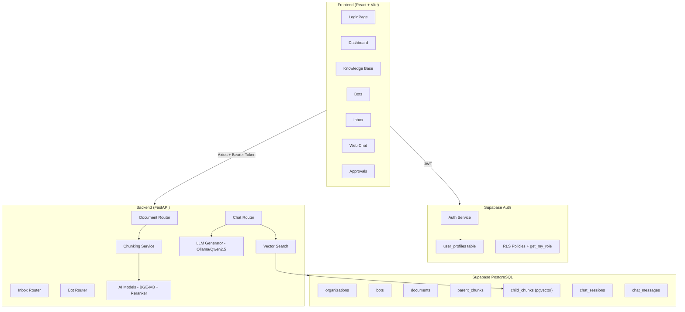
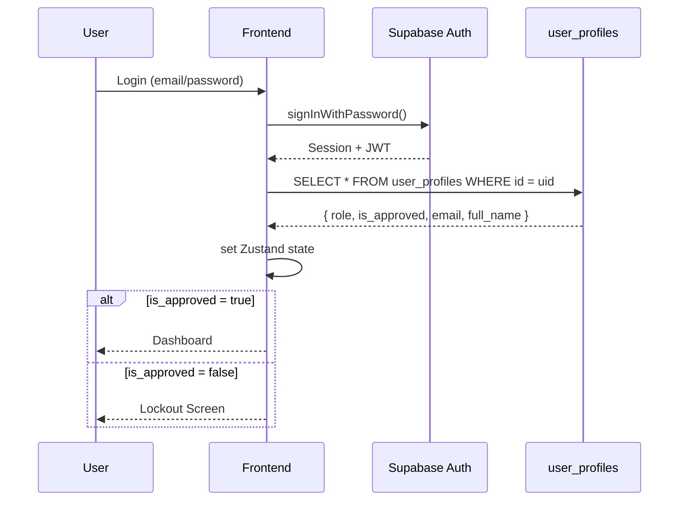
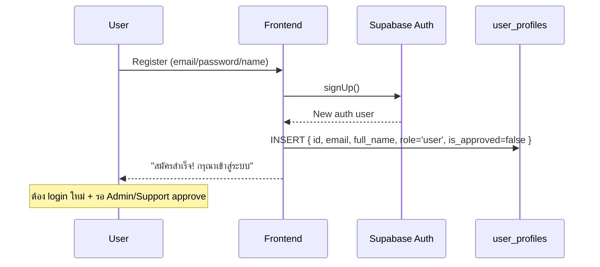

# SUNDAE — รายงานสรุปโปรเจกต์ฉบับเต็ม

> **วันที่รายงานครั้งแรก**: 25 กุมภาพันธ์ 2569
> **อัพเดทล่าสุด**: 14 มีนาคม 2569
> **Project**: SUNDAE — Enterprise AI Chatbot Platform
> **Stack**: FastAPI + React + Supabase + Ollama

---

## 1. ภาพรวมสถาปัตยกรรม (Architecture)



---

## 2. Backend (FastAPI + Python)

### 2.1 Project Structure ✅

```
backend/
├── app/
│   ├── main.py              # FastAPI app + CORS
│   ├── core/
│   │   ├── config.py         # Settings from .env
│   │   ├── auth.py           # JWT middleware (get_current_user, require_approved, require_role)
│   │   └── database.py       # Supabase async client (service role)
│   ├── routers/
│   │   ├── document.py       # Upload, list, delete
│   │   ├── chat.py           # Omnichannel (Web + LINE) + streaming SSE
│   │   ├── inbox.py          # Session management + human handoff
│   │   ├── bot.py            # Bot CRUD
│   │   └── health.py
│   ├── services/
│   │   ├── chunking.py       # Thai text splitter
│   │   ├── ai_models.py      # Embedding + Reranker
│   │   ├── vector_search.py  # Supabase RPC search
│   │   └── llm_generator.py  # Ollama/Qwen2.5
│   └── models/               # Pydantic schemas
├── sql/
│   ├── 001_schema.sql        # Full DB schema
│   ├── 002_add_missing_columns.sql
│   ├── 003_user_profiles_rls.sql
│   ├── 004_auth_trigger.sql
│   ├── 005_create_support_account.sql
│   ├── 006_match_chunks_bot_filter.sql
│   ├── 007_admin_role.sql
│   ├── 008_fix_organizations_rls.sql
│   └── 009_fix_user_profiles_rls_update.sql
└── requirements.txt
```

### 2.2 Database Schema ✅

| Table | Primary Key | สำคัญ |
|-------|------------|-------|
| `organizations` | UUID | Multi-tenant root |
| `user_profiles` | UUID (FK → auth.users) | role, is_approved, email, full_name |
| `bots` | UUID | prompt, line_access_token, is_web_enabled |
| `documents` | UUID | file_path, status, FK → bots |
| `document_parent_chunks` | UUID | content, metadata |
| `document_child_chunks` | UUID | **embedding vector(1024)**, FK → parent |
| `chat_sessions` | UUID | platform_source, status |
| `chat_messages` | UUID | role, content, FK → session |

RPC Function: `match_child_chunks` — cosine similarity search บน pgvector

### 2.3 AI Services ✅

| Service | Model | หน้าที่ |
|---------|-------|--------|
| Embedding | BAAI/bge-m3 (1024 dims) | แปลงข้อความเป็น vector |
| Reranker | BAAI/bge-reranker-v2-m3 | จัดลำดับผลลัพธ์ |
| LLM | Ollama/qwen2.5:3b ⚠️ | สร้างคำตอบจาก context (ดูหมายเหตุ) |
| Chunking | Custom Thai Splitter | ตัด text เป็น parent/child chunks |

### 2.4 Auth Middleware (core/auth.py)

```
get_current_user  → ตรวจ Bearer token → ดึง user_profiles จาก DB (service role)
require_approved  → เช็ค is_approved = true → 403 ถ้าไม่ผ่าน
require_role(...) → เช็ค role + is_approved → 403 ถ้าไม่ผ่าน
```

Backend ใช้ **Service Role Key** — bypass RLS ทั้งหมด ทำให้อ่านค่า `is_approved` จริงจาก DB เสมอ

---

## 3. Frontend (React + Vite + Tailwind v4)

### 3.1 Project Structure ✅

```
frontend/src/
├── api/
│   ├── supabaseClient.ts    # Singleton Supabase client (custom lock, periodic refresh)
│   ├── axios.ts             # JWT interceptor (3 layers)
│   └── endpoints.ts         # API calls (documents, chat, inbox, bots)
├── store/
│   ├── authStore.ts         # Zustand (signIn/signOut/fetchProfile)
│   └── toastStore.ts        # Toast notification state
├── types/
│   └── index.ts             # TypeScript interfaces (synced DB)
├── components/
│   ├── ProtectedRoute.tsx   # Role guard
│   ├── Spinner.tsx          # Shared loading spinner
│   └── ToastContainer.tsx   # Global toast UI
├── layouts/
│   ├── DashboardLayout.tsx  # Sidebar + approval lockout
│   └── AuthLayout.tsx       # Login background
├── pages/
│   ├── LoginPage.tsx           # Login + Registration tabs
│   ├── ForgotPasswordPage.tsx  # ขอลิงก์ reset password ทาง email
│   ├── ResetPasswordPage.tsx   # ตั้งรหัสผ่านใหม่จากลิงก์ email
│   ├── DashboardPage.tsx       # 3 role-based states
│   ├── WebChatPage.tsx         # Chat interface + streaming + cancel button
│   ├── ApprovalsPage.tsx       # Admin/Support approval list (real DB)
│   ├── KnowledgeBasePage.tsx
│   ├── BotsPage.tsx
│   ├── InboxPage.tsx           # Human handoff inbox (admin perspective)
│   └── IntegrationPage.tsx
├── App.tsx                  # AuthProvider + Routing
├── index.css                # NT CI Design System
└── main.tsx                 # Entry point
```

### 3.2 Token Protection Strategy (axios.ts) ✅

3 layers ป้องกัน token หมดอายุ:

```
Layer 1 (Request Interceptor) → getValidToken()
  → อ่าน session จาก cache
  → ถ้า expires_at - now < 300s (5 นาที) → refreshSession() ก่อน
  → ส่ง token ใหม่ทุก request

Layer 2 (Response Interceptor) → retry on 401
  → ถ้าได้ 401 → refreshTokenOnce() → retry request อีกครั้ง
  → ถ้า refresh fail → toast "เซสชันหมดอายุ" → redirect /login

Layer 3 (supabaseClient.ts)
  → Periodic refresh ทุก 30 นาที
  → Refresh เมื่อ tab กลับมา focus (หลังห่างไป 5 นาที)
```

**Mutex**: `refreshPromise` ป้องกัน concurrent refresh ที่จะ invalidate refresh token

### 3.3 บั๊ก JWT หมดอายุแล้วหน้าเว็บค้าง (401) — Patch Summary ✅

**อาการที่พบ**

- **[อาการ]** เปิดหน้าเว็บทิ้งไว้สักพัก → เริ่มกดใช้งานต่อไม่ได้/ส่งแชทไม่ได้ → Network ขึ้น `401 Unauthorized` หลาย endpoint พร้อมกัน
- **[อาการ]** ในหน้า Web Chat จะเห็น error เช่น `Not authenticated` และบางครั้งเหมือน UI “ค้าง” จนต้องกด Refresh เพื่อให้โหลด token ใหม่

**สาเหตุหลัก (Root Cause)**

- **[สาเหตุ]** เส้นทาง SSE streaming (`chatApi.askStream`) ใช้ `fetch` (ไม่ผ่าน axios interceptor)
- **[สาเหตุ]** การดึง session/token จาก Supabase (`getSession()`/`refreshSession()`) เคยมีโอกาส “ค้าง/ไม่ตอบกลับ” หรือคืน `session = null` หลัง idle/sleep/network ทำให้ไม่มี `Authorization` header แล้ว API 401 รัว ๆ
- **[ผล]** UI ฝั่งหน้าแชทตั้ง `isLoading=true` แล้วรอ callback (`onDone/onError`) หากโค้ดค้างก่อนเรียก callback จะดูเหมือนหน้าเว็บค้าง

**สิ่งที่แก้ไข (ไฟล์ + พฤติกรรม)**

- **[frontend/src/api/axios.ts]**
  - เพิ่ม timeout (`withTimeout` 10s) ครอบ `supabase.auth.getSession()` และ `supabase.auth.refreshSession()` เพื่อกัน await ค้าง
  - export `refreshTokenOnce()` เพื่อให้ flow ที่ไม่ได้ใช้ axios (SSE) reuse refresh mutex เดียวกัน

- **[frontend/src/api/endpoints.ts]** (เฉพาะ `chatApi.askStream`)
  - ถ้า `getValidToken()` ได้ `null` → toast “เซสชันหมดอายุ” → redirect `/login` (ไม่ต้องกด Refresh เอง)
  - ถ้า `fetch` ได้ `401` → `refreshTokenOnce()` → retry 1 ครั้ง
  - ถ้า refresh fail → toast + redirect `/login`

- **[frontend/src/api/supabaseClient.ts]** (Token keep-alive)
  - เพิ่ม timeout 10s ครอบ `getSession()`/`refreshSession()`
  - เพิ่ม mutex `refreshPromise` กัน refresh ซ้อน
  - เพิ่ม fail-safe: ถ้า `session` เป็น `null` หรือ refresh fail ต่อเนื่อง (>= 2 ครั้ง) → `signOut()` + ล้าง key `sb-*` + redirect `/login`

**ผลลัพธ์ที่คาดหวังหลังแก้**

- **[expected]** ถ้า access token หมดอายุแต่ refresh ยังใช้ได้ → ระบบ refresh แล้วใช้งานต่อเนื่องได้
- **[expected]** ถ้า refresh token ตาย/ได้ session = null → ระบบจะเด้งไป `/login` อัตโนมัติ (ไม่ค้าง และไม่ต้อง Refresh หน้าเอง)

**วิธีทดสอบ**

- **[ทดสอบ]** เปิด `/chat` ทิ้งไว้จน token ใกล้หมดอายุ แล้วลองส่งข้อความ
- **[ทดสอบ]** สลับเน็ต/ปล่อยเครื่อง sleep แล้วกลับมา ลองส่งข้อความ
- **[ทดสอบ]** ดูใน Network ว่าถ้ามี `401` จะ redirect ไป `/login` และไม่ค้างหน้าเดิม

---

### 3.4 Admin Inbox Realtime + สถานะช่วยเหลือเรียบร้อย (helped) — Patch Summary ✅

**เป้าหมาย**

- **[เป้าหมาย]** เมื่อผู้ใช้กดเรียก Admin → หน้า Inbox ของ Admin ต้องเห็น session ใหม่/ข้อความใหม่แบบอัตโนมัติ
- **[เป้าหมาย]** Admin กด “รับเรื่อง” แล้วคุยแทน bot ได้ทันที
- **[เป้าหมาย]** เปลี่ยนปุ่ม “ปิดเคส” เป็น “ช่วยเหลือเรียบร้อย” เพื่อไม่ล็อก user (ยังใช้งานแชทเดิม + เรียก admin ได้อีก)

**สิ่งที่แก้ไข (ไฟล์ + พฤติกรรม)**

- **[frontend/src/pages/InboxPage.tsx]**
  - เพิ่ม polling:
    - session list ทุก 3s (silent refresh ไม่กระพริบ loading)
    - new messages ทุก 2s ผ่าน `/api/inbox/sessions/{id}/messages/new`
  - เพิ่มสถานะ `helped` (label: “ช่วยเหลือเรียบร้อย”) และเปลี่ยนปุ่มจาก “ปิดเคส” → “ช่วยเหลือเรียบร้อย”

- **[frontend/src/pages/WebChatPage.tsx]**
  - `helped` ถือว่า “ยังใช้งานได้” เหมือน `active`:
    - input ไม่ถูกปิด
    - user ยังสามารถกด “ขอพูดคุยกับเจ้าหน้าที่” ได้
  - ถ้า backend เปลี่ยนสถานะเป็น `helped` จะขึ้น system message แจ้งว่า “ช่วยเหลือเรียบร้อยแล้ว…“

- **[frontend/src/types/index.ts]**
  - เพิ่ม `SessionStatus = "active" | "human_takeover" | "helped" | "resolved"`

- **[backend/app/routers/inbox.py]**
  - เพิ่ม `helped` ในสถานะที่อนุญาตสำหรับ update status
  - ปรับ behavior: ถ้า session เป็น `helped` แล้ว admin ส่งข้อความ → auto กลับไป `human_takeover`

**SQL ที่ต้องรันเพิ่ม (สำคัญ)**

- **[backend/sql/010_add_helped_status.sql]**
  - อัปเดต `CHECK constraint` ของ `chat_sessions.status` ให้รองรับค่า `helped`

---

### 3.5 สลับหน้า Bots → Inbox แล้วค้าง/เด้งกลับ Dashboard — Patch Summary ✅

**อาการที่พบ**

- **[อาการ]** สลับหน้าจาก `Bots` ไป `Inbox` → หน้า Inbox โหลดไม่ขึ้น/ใช้งานไม่ได้ จนต้องกด Refresh
- **[อาการ]** บางครั้งรอสักพักแล้วเหมือน “refresh เอง” และ/หรือถูกพากลับไปหน้า Dashboard

**สาเหตุหลัก (Root Cause)**

- **[สาเหตุ]** `/inbox` เป็น route ที่จำกัดสิทธิ์ (admin-only)
- **[สาเหตุ]** ตอน navigate ข้ามหน้า บางจังหวะ `isAuthenticated = true` แล้ว แต่ `user.role` ยังไม่ถูกโหลด (กำลัง `fetchProfile()`)
- **[ผล]** Route guard ประเมิน role เป็น `undefined` ชั่วคราว ทำให้เกิด routing ที่ไม่เสถียร/ค้าง/ต้อง refresh เพื่อให้ state กลับมาครบ

**วิธีแก้ (ไฟล์ + พฤติกรรม)**

- **[frontend/src/components/ProtectedRoute.tsx]**
  - ถ้า route มี `allowedRoles` แต่ `role` ยังไม่มา → แสดง loading state “กำลังโหลดสิทธิ์การใช้งาน...”
  - รอจน role โหลดเสร็จแล้วค่อยตัดสินใจอนุญาต/redirect

## 4. Supabase Auth Integration

### 4.1 Auth Flow



### 4.2 Registration Flow



---

## 5. RLS Security (Row Level Security)

### 5.1 Policies ปัจจุบัน (Final Version — migration 009)

```sql
-- Helper function (SECURITY DEFINER = bypass RLS ป้องกัน infinite recursion)
CREATE FUNCTION get_my_role() RETURNS TEXT
SECURITY DEFINER AS $$
    SELECT role FROM user_profiles WHERE id = auth.uid();
$$;

-- SELECT: ตัวเอง + Support/Admin ดูทุกคน
USING (id = auth.uid() OR get_my_role() IN ('support','admin'))

-- UPDATE: เฉพาะ Support/Admin (ป้องกัน privilege escalation)
-- มีทั้ง USING และ WITH CHECK (migration 009 เพิ่ม WITH CHECK)
USING (get_my_role() IN ('support','admin'))
WITH CHECK (get_my_role() IN ('support','admin'))

-- INSERT: สมัครสมาชิก (id ต้อง = auth.uid)
WITH CHECK (id = auth.uid())
```

### 5.2 Organizations RLS (migration 008)

```sql
-- แก้จาก org_isolation ที่ใช้ JWT claim ที่ไม่มีอยู่จริง
CREATE POLICY "org_read_own" ON organizations
    FOR SELECT USING (
        id IN (SELECT organization_id FROM user_profiles WHERE id = auth.uid())
    );
```

---

## 6. Bugs ที่พบ & แก้ไขแล้ว

| # | Bug | สาเหตุ | วิธีแก้ | ไฟล์ |
|---|-----|--------|---------|------|
| B1 | Loading screen ค้าง | ไม่มี `.catch()` + ไม่มี timeout | เพิ่ม `.catch()` + 5s timeout | `App.tsx` |
| B2 | user_profiles ไม่มี email/full_name | ขาด columns | เพิ่ม columns + sync types | `002_add_missing_columns.sql` |
| B3 | RLS blocks profile read | Policy ไม่มี SELECT สำหรับตัวเอง | เพิ่ม `id = auth.uid()` | `003_user_profiles_rls.sql` |
| B4 | RLS infinite recursion | Subquery ใน policy อ่าน user_profiles ซ้ำ | สร้าง `get_my_role()` SECURITY DEFINER | `003_user_profiles_rls.sql` |
| B5 | Stream ไม่ยิง request (Network ว่าง) | `import("./supabaseClient")` แบบ dynamic แฮงค์ใน Vite build | เปลี่ยนเป็น static import ที่ top | `endpoints.ts` |
| B6 | Organizations 406 Not Acceptable | RLS policy `org_isolation` ใช้ `auth.jwt() ->> 'organization_id'` ที่ไม่มีใน Supabase JWT | สร้าง policy ใหม่ใช้ subquery | `008_fix_organizations_rls.sql` |
| B7 | "Failed to fetch" บน Login | `signIn()` ไม่มี `catch` block | เพิ่ม `catch` + Thai error message | `authStore.ts` |
| B8 | User role 403 บน Inbox endpoints | `is_approved = false` ใน DB แม้ Admin กด approve แล้ว | RLS UPDATE policy ขาด `WITH CHECK` + approve ไม่ check rows affected | `009_fix_user_profiles_rls_update.sql`, `ApprovalsPage.tsx` |
| B9 | Stream หยุดทำงานหลังผ่านไปสักพัก | `askStream` ใช้ `getSession()` ดิบ ไม่เช็ค expiry ไม่ refresh token | เปลี่ยนเป็น `getValidToken()` ที่ export จาก axios.ts | `endpoints.ts`, `axios.ts` |
| B10 | Ollama unload model หลัง idle 30 นาที → stream ค้าง | `keep_alive: "30m"` → model ถูก unload → reload นาน → Network graph ว่าง | เพิ่มเป็น `keep_alive: "4h"` | `llm_generator.py` |
| B11 | Inbox Admin view: ข้อความ layout ผิด | ใช้ perspective ของ "user" — `user` messages ชิดขวา, `assistant` ชิดซ้าย | เปลี่ยนเป็น Admin perspective: user (ลูกค้า) ซ้าย, assistant+admin ขวา | `InboxPage.tsx` |

---

## 7. การแก้ไขสำคัญในรอบนี้ (มีนาคม 2569)

### 7.1 Stream Token Fix (B9)

**ปัญหา**: หลังใช้งานสักพัก JWT หมดอายุ แต่ `askStream` ใช้ `supabase.auth.getSession()` ดิบ → ได้ expired token → backend 401 → stream ล้มเหลว

**วิธีแก้**:
- Export `getValidToken()` จาก `axios.ts` (เดิมเป็น private function)
- `askStream` ใน `endpoints.ts` เปลี่ยนมาใช้ `getValidToken()` แทน
- ทำให้ stream ใช้ระบบ refresh เดียวกับ axios ทุก request (เช็ค expiry + refresh อัตโนมัติ)

```typescript
// ก่อน (ไม่เช็ค expiry)
const { data: { session } } = await supabase.auth.getSession();
token = session?.access_token;

// หลัง (auto-refresh ถ้าใกล้หมดอายุ)
const token = await getValidToken();
```

### 7.2 Ollama Keep-Alive Fix (B10)

**ปัญหา**: `keep_alive: "30m"` → Ollama unload model ออกจาก RAM หลัง idle 30 นาที → request ถัดไปต้อง reload model → ระหว่างนั้น Network graph ว่างเปล่า user คิดว่าระบบพัง

**วิธีแก้**: เปลี่ยน `keep_alive: "4h"` ใน `llm_generator.py` ทั้ง 2 ที่ (non-stream และ stream)

### 7.3 ApprovalsPage Silent Failure Fix (B8)

**ปัญหา**: Supabase UPDATE ที่ถูก RLS block จะ return `{ data: [], error: null }` — ไม่มี error แต่ไม่มี row ถูก update จริง Frontend ไม่รู้ว่าล้มเหลว

**วิธีแก้**: เพิ่ม `.select()` หลัง `.update()` → ถ้า `data.length === 0` → แสดง error toast "RLS policy blocked"

```typescript
// ก่อน (ไม่รู้ว่า update สำเร็จจริงไหม)
const { error } = await supabase.from("user_profiles").update({ is_approved: true }).eq("id", userId);

// หลัง (ตรวจสอบจริง)
const { data, error } = await supabase.from("user_profiles")
    .update({ is_approved: true }).eq("id", userId).select("id, is_approved");
if (!data || data.length === 0) { /* แจ้ง error */ }
```

### 7.4 RLS UPDATE WITH CHECK Fix (migration 009)

**ปัญหา**: UPDATE policy มีแค่ `USING` แต่ไม่มี `WITH CHECK` → พฤติกรรมอาจไม่ชัดเจนใน PostgreSQL

**วิธีแก้**: เพิ่ม `WITH CHECK (get_my_role() IN ('support', 'admin'))` และมี SQL สำหรับ approve user โดยตรงด้วย

### 7.5 Inbox Admin Perspective Fix (B11)

**ปัญหา**: `InboxPage.tsx` render messages ด้วย perspective ของ "user" — ข้อความ `role: "user"` (ลูกค้า) ชิดขวา แทนที่จะชิดซ้าย

**วิธีแก้**: เปลี่ยน layout logic เป็น Admin perspective:

| Role | ตำแหน่ง | สี | Avatar |
|---|---|---|---|
| `user` (ลูกค้า) | **ซ้าย** | ขาว + border | U (เทา) |
| `assistant` (AI SUNDAE) | **ขวา** | เหลืองอ่อน (brand) | S (เหลือง) |
| `admin` (เจ้าหน้าที่) | **ขวา** | น้ำเงิน | A (น้ำเงิน) |
| `system` | **กลาง** | แบนเนอร์เหลือง | — |

### 7.6 Cleanup ก่อน Push ไป GitHub

ลบไฟล์ test/dummy ออกทั้งหมด + เพิ่ม `.gitignore`:

**ลบ**:
- `docker_out.txt`, `dummy.docx`, `dummy.pdf`
- `test_results*.txt/json` ทั้งหมด (root + frontend)
- `test_backend_*.py` (root level)
- `frontend/e2e*.spec.ts`, `frontend/playwright.config.ts`
- `Manual Browser Test *.md`, `Test Object.md`, `UI Test Checklist.md`, `Next Step.md`

**เพิ่มใน .gitignore**:
```
.claude/          # Claude Code session files
test-results/     # Test output directories
frontend/test-results/
```

---

## 8. ไฟล์ที่แก้ไขในรอบนี้

| ไฟล์ | การเปลี่ยนแปลง |
|------|---------------|
| `frontend/src/api/axios.ts` | Export `getValidToken()` |
| `frontend/src/api/endpoints.ts` | ใช้ `getValidToken()` แทน raw `getSession()`, ลบ supabase import |
| `frontend/src/pages/ApprovalsPage.tsx` | เพิ่ม `.select()` หลัง update + ตรวจสอบ rows affected |
| `frontend/src/pages/InboxPage.tsx` | เปลี่ยนเป็น Admin perspective (user ซ้าย, AI+admin ขวา) |
| `backend/app/services/llm_generator.py` | `keep_alive: "30m"` → `"4h"` (ทั้ง stream และ non-stream) |
| `backend/sql/008_fix_organizations_rls.sql` | แก้ RLS policy organizations |
| `backend/sql/009_fix_user_profiles_rls_update.sql` | เพิ่ม WITH CHECK + SQL approve user |
| `.gitignore` | เพิ่ม `.claude/`, `test-results/` |

---

## 9. SQL Migrations (001 → 009) — ทำอะไรบ้าง

> **หมายเหตุ**: Migration 001-007 รันไปแล้วทั้งหมด ส่วน 008-009 รันล่าสุดในรอบนี้

---

### 001 — Schema หลัก ✅ รันแล้ว

**สร้าง tables ทั้งหมดของระบบ**:

| Table | หน้าที่ |
|-------|--------|
| `organizations` | Multi-tenant root — เก็บข้อมูลองค์กร |
| `bots` | Bot แต่ละตัวขององค์กร |
| `documents` | เอกสารที่อัพโหลด (PDF ฯลฯ) |
| `document_parent_chunks` | Chunk ขนาดใหญ่สำหรับส่งให้ LLM |
| `document_child_chunks` | Chunk เล็ก + **embedding vector(1024)** สำหรับ search |
| `chat_sessions` | Session การสนทนาแต่ละครั้ง |
| `chat_messages` | ข้อความทุกข้อในแต่ละ session |

สร้าง RPC function `match_child_chunks` สำหรับ cosine similarity search ด้วย pgvector

---

### 002 — เพิ่ม columns ที่ขาดหาย ✅ รันแล้ว

**ปัญหา**: หลัง schema 001 ถูก deploy แล้ว พบว่า frontend ต้องการ columns เพิ่มเติมที่ไม่มีใน schema แรก

**สิ่งที่เพิ่ม**:
```sql
-- bots table
ALTER TABLE bots ADD COLUMN line_access_token TEXT;         -- สำหรับ LINE integration
ALTER TABLE bots ADD COLUMN is_web_enabled BOOLEAN DEFAULT true;  -- เปิด/ปิด Web Chat

-- chat_sessions table
ALTER TABLE chat_sessions ADD COLUMN status TEXT            -- active | human_takeover | resolved
ALTER TABLE chat_sessions ADD COLUMN platform_source TEXT;  -- web | line | other
ALTER TABLE chat_sessions ADD COLUMN platform_user_id TEXT; -- User ID จาก platform
```

---

### 003 — user_profiles + RLS + get_my_role() ✅ รันแล้ว

**ปัญหา**: ระบบต้องการเก็บข้อมูล role และการ approve ของ user แต่ Supabase auth.users แก้ไขตรงๆ ไม่ได้

**สิ่งที่สร้าง**:

1. **Table `user_profiles`** — เชื่อมกับ `auth.users` เก็บ `role`, `is_approved`, `email`, `full_name`

2. **Function `get_my_role()`** — `SECURITY DEFINER` ป้องกัน infinite recursion ใน RLS policies:
```sql
-- ถ้าใช้ subquery ตรงๆ ใน policy จะเกิด recursion loop
-- แก้ด้วย function ที่ bypass RLS
CREATE FUNCTION get_my_role() RETURNS TEXT SECURITY DEFINER AS $$
    SELECT role FROM user_profiles WHERE id = auth.uid();
$$;
```

3. **RLS Policies**:
   - SELECT: user อ่านได้เฉพาะของตัวเอง, Support/Admin อ่านได้ทุกคน
   - UPDATE: เฉพาะ Support/Admin (ป้องกัน user เปลี่ยน role ตัวเอง)
   - INSERT: user สมัครได้เฉพาะ profile ของตัวเอง

4. **Seed admin account** (`admin@sundae.local`)

---

### 004 — Auth Trigger (Auto-create profile) ✅ รันแล้ว

**ปัญหา**: เมื่อ user สมัครสมาชิก (`signUp()`), Supabase สร้าง `auth.users` แต่ `user_profiles` ยังว่าง → RLS block ไม่ให้ user สร้าง profile ตัวเองได้เพราะ `auth.uid()` = null ระหว่างขั้นตอน email confirmation

**วิธีแก้**: สร้าง **database trigger** ที่ auto-สร้าง `user_profiles` ทันทีที่มี user ใหม่ใน `auth.users`:
```sql
CREATE TRIGGER on_auth_user_created
    AFTER INSERT ON auth.users
    FOR EACH ROW EXECUTE FUNCTION handle_new_auth_user();
-- → auto insert user_profiles (role=user, is_approved=false, organization=SUNDAE Demo Org)
```

---

### 005 — สร้าง Support Account ✅ รันแล้ว

**ปัญหา**: ต้องการ account สำหรับทีม Support ที่มี role = `support`

**วิธี**: ไม่สามารถ INSERT ตรงเข้า `auth.users` ได้ (จะทำให้ schema เสีย) ต้องใช้ Supabase Admin API สร้าง auth user ก่อน แล้วจึงรัน SQL อัพเดท role:
```sql
UPDATE user_profiles
SET role = 'support', is_approved = true, organization_id = '...'
WHERE email = 'support@sundae.local';
```

Login: `support@sundae.local` / `Sundae@2025`

---

### 006 — Bot Filter ใน Vector Search ✅ รันแล้ว

**ปัญหา**: `match_child_chunks` RPC เดิมค้นหา documents **ทั้งหมดในองค์กร** โดยไม่กรองว่า document ผูกกับ bot ไหน → Bot A อาจได้ข้อมูลจาก document ของ Bot B

**วิธีแก้**: เพิ่ม parameter `target_bot_id` ใน RPC function:
```sql
CREATE FUNCTION match_child_chunks(
    query_embedding VECTOR(1024),
    target_org_id   UUID,
    match_count     INTEGER DEFAULT 20,
    target_bot_id   UUID DEFAULT NULL  -- ← เพิ่มใหม่
)
-- ถ้าส่ง bot_id มา → กรองเฉพาะ documents ที่ผูกกับ bot นั้น
AND (target_bot_id IS NULL OR dcc.document_id IN (
    SELECT id FROM documents WHERE bot_id = target_bot_id
))
```

---

### 007 — เพิ่ม role 'admin' ใน chat_messages ✅ รันแล้ว

**ปัญหา**: เมื่อ Admin/Support ต้องการตอบกลับลูกค้าใน Inbox (Human Handoff) ระบบ error เพราะ constraint ของ `role` column ใน `chat_messages` ยอมรับแค่ `user`, `assistant`, `system`

**วิธีแก้**:
```sql
ALTER TABLE chat_messages DROP CONSTRAINT chat_messages_role_check;
ALTER TABLE chat_messages ADD CONSTRAINT chat_messages_role_check
    CHECK (role IN ('user', 'assistant', 'system', 'admin'));  -- ← เพิ่ม 'admin'
```

---

### 008 — แก้ Organizations RLS ✅ รันแล้ว (รอบนี้)

**ปัญหา**: Frontend ได้รับ HTTP 406 เมื่อ query `organizations` table เพราะ RLS policy เดิมใช้ `auth.jwt() ->> 'organization_id'` แต่ Supabase **ไม่ใส่ custom claim นี้ใน JWT** โดยอัตโนมัติ

**วิธีแก้**: เปลี่ยน policy ให้ query จาก `user_profiles` แทน:
```sql
DROP POLICY "org_isolation" ON organizations;

CREATE POLICY "org_read_own" ON organizations FOR SELECT USING (
    id IN (SELECT organization_id FROM user_profiles WHERE id = auth.uid())
);
CREATE POLICY "org_service_role" ON organizations FOR ALL USING (
    auth.role() = 'service_role'
);
```

---

### 009 — แก้ RLS UPDATE + Approve User ✅ รันแล้ว (รอบนี้)

**ปัญหา**: Admin กด "อนุมัติ" ใน ApprovalsPage แต่ `is_approved` ไม่เปลี่ยนเป็น `true` ใน DB เพราะ:
1. RLS UPDATE policy มีแค่ `USING` ไม่มี `WITH CHECK` → Supabase อาจ block แบบเงียบ
2. Frontend ไม่ตรวจสอบว่า update สำเร็จจริงหรือเปล่า

**วิธีแก้**:
```sql
-- ลบ policy เก่า แล้วสร้างใหม่พร้อม WITH CHECK
DROP POLICY "Only support/admin can update profiles" ON user_profiles;
CREATE POLICY "Only support/admin can update profiles"
ON user_profiles FOR UPDATE
USING    (get_my_role() IN ('support', 'admin'))
WITH CHECK (get_my_role() IN ('support', 'admin'));  -- ← เพิ่มใหม่

-- Approve user โดยตรง (สำรองถ้า UI ยังไม่ทำงาน)
UPDATE user_profiles SET is_approved = true
WHERE email = 'sawasdichai.amor@bumail.net' AND is_approved = false;
```

---

### สรุป Migration ทั้งหมด

| # | Migration | สถานะ | ปัญหาที่แก้ |
|---|-----------|-------|------------|
| 001 | Schema หลัก | ✅ รันแล้ว | สร้าง DB ทั้งหมด |
| 002 | เพิ่ม columns | ✅ รันแล้ว | LINE integration + session status |
| 003 | user_profiles + RLS | ✅ รันแล้ว | ระบบ role + is_approved + get_my_role() |
| 004 | Auth trigger | ✅ รันแล้ว | Auto-create profile ตอนสมัครสมาชิก |
| 005 | Support account | ✅ รันแล้ว | สร้าง Support user |
| 006 | Bot filter vector search | ✅ รันแล้ว | Bot ค้นหาเฉพาะ doc ของตัวเอง |
| 007 | Admin role in messages | ✅ รันแล้ว | Human handoff ตอบกลับได้ |
| 008 | Fix organizations RLS | ✅ รันแล้ว | แก้ 406 error บน organizations |
| 009 | Fix UPDATE RLS + approve | ✅ รันแล้ว | แก้ approve ไม่ทำงาน |
| 010 | Add helped status | ✅ ทำแล้ว | เพิ่มสถานะ `helped` (ช่วยเหลือเรียบร้อย) ให้ chat_sessions.status |

---

## 10. ⚠️ LLM Model — qwen2.5:3b (ปัจจุบัน) แทน qwen3:14b

### สาเหตุที่เปลี่ยน

| Model | RAM ที่ต้องการ | สถานะ |
|-------|--------------|-------|
| `qwen3:14b` | ~16 GB | ❌ RAM ไม่พอบนเครื่อง dev |
| `qwen2.5:7b` | ~8 GB | ⚠️ ได้ถ้า RAM พอ |
| **`qwen2.5:3b`** | **~4 GB** | ✅ **ใช้อยู่ปัจจุบัน** |

Model ถูก set ผ่าน `LLM_MODEL=qwen2.5:3b` ใน `backend/.env`

### ผลกระทบต่อคุณภาพ

| ด้าน | qwen3:14b | qwen2.5:3b |
|------|-----------|------------|
| ภาษาไทย | ดีมาก | ดี (อาจสั้นกว่า) |
| ความแม่นยำ | สูง | ปานกลาง-สูง |
| ความเร็ว | ช้ากว่า | เร็วกว่า |
| RAM | 16 GB | 4 GB |

### ไฟล์ที่เกี่ยวข้อง (ไม่ต้องแก้ — อ่านจาก .env อัตโนมัติ)

| ไฟล์ | สิ่งที่ทำ | แก้แล้ว? |
|------|---------|---------|
| `backend/.env` | `LLM_MODEL=qwen2.5:3b` | ✅ ถูกต้องแล้ว |
| `backend/.env.example` | อัพเดท default + comment เลือก model | ✅ แก้แล้ว |
| `backend/app/core/config.py` | default `qwen2.5:3b` | ✅ แก้แล้ว |
| `backend/app/services/llm_generator.py` | docstring comment | ✅ แก้แล้ว |
| `backend/tests/test_llm_generator.py` | hardcode `qwen3:14b` ใน test params | ⚠️ **ยังไม่แก้** (ดูด้านล่าง) |

### ⚠️ สิ่งที่ต้องแก้เพิ่มในโปรเจกต์

**1. Unit tests (`backend/tests/test_llm_generator.py`)**

Tests hardcode `llm_model="qwen3:14b"` ไว้ 7 ที่ — ควรเปลี่ยนเป็น `qwen2.5:3b` หรือ mock model name แทน:

```python
# ก่อน (7 ที่ใน test file)
llm_model="qwen3:14b"

# หลัง
llm_model="qwen2.5:3b"
```

**2. `backend/scripts/evaluate_accuracy.py`**

มี comment: `"Ollama running with qwen3:14b loaded"` — ควรอัพเดทเป็น `qwen2.5:3b`

**3. ถ้า upgrade RAM ในอนาคต**

เปลี่ยนแค่บรรทัดเดียวใน `backend/.env`:
```
LLM_MODEL=qwen2.5:7b   # ถ้ามี RAM 8 GB
LLM_MODEL=qwen3:14b    # ถ้ามี RAM 16 GB
```
ไม่ต้องแก้ code ที่ไหนเลย เพราะ `llm_generator.py` อ่านค่าจาก `settings.llm_model` เสมอ

---

## 10. Admin Account (สำหรับทดสอบ)

| Field | Value |
|-------|-------|
| 📧 Email | `admin@sundae.local` |
| 🔑 Password | `Admin@1234` |
| 👑 Role | `admin` |
| ✅ Approved | `true` |

> **หมายเหตุ**: `admin@sundae.local` เป็นอีเมลจำลอง ไม่สามารถใช้ Forgot Password ได้
> รหัสผ่านถูก reset ผ่าน Supabase Admin API (14 มี.ค. 2569)

---

## 11. สิ่งที่ต้องทำก่อน Push ไป GitHub

### SQL ที่ต้องรันใน Supabase SQL Editor 

```sql
-- Migration 009: แก้ RLS UPDATE + approve user
-- ไฟล์: backend/sql/009_fix_user_profiles_rls_update.sql

-- Migration 010: เพิ่มสถานะ helped (ช่วยเหลือเรียบร้อย)
-- ไฟล์: backend/sql/010_add_helped_status.sql
```

### คำสั่ง Run Development

```bash
# Backend
cd backend
uvicorn app.main:app --host 0.0.0.0 --port 8001 --reload

# Frontend
cd frontend
npm run dev
```

---

## 12. Code Review รอบใหญ่ — Full Codebase Audit (13 มีนาคม 2569)

### 12.1 ภาพรวม

ทำ Code Review ทั้ง Backend และ Frontend **3 รอบ** พบและแก้ไขบั๊กทั้งหมด **51 จุด** (20 จุดในรอบแรก + 22 จุดในรอบสอง + 8 จุดในรอบสาม + 1 บั๊กจาก User report) ครอบคลุมทั้ง Security, Logic, Performance และ UX

---

### 12.2 รอบที่ 1 — พบ 20 บั๊ก แก้ไขครบ ✅

#### P0 — Critical (แก้ทันที)

| # | บั๊ก | ไฟล์ | สิ่งที่แก้ |
|---|------|------|----------|
| 1 | `verify_organization` ไม่ถูกเรียกใน `inbox.py` | `backend/app/routers/inbox.py` | เพิ่ม `verify_organization(user, organization_id)` ทุก endpoint |
| 2 | `verify_organization` ไม่ถูกเรียกใน `chat.py` | `backend/app/routers/chat.py` | เพิ่ม `verify_organization(user, body.organization_id)` ใน `send_user_message` และ `request_human` |
| 3 | Timestamp ใช้ `"now()"` string แทน real timestamp | `backend/app/routers/chat.py` | เปลี่ยนจาก `"now()"` เป็น `datetime.now(timezone.utc).isoformat()` |
| 4 | Error detail leak ข้อมูล internal | `backend/app/routers/inbox.py`, `chat.py` | เปลี่ยน `detail=str(exc)` เป็น generic message เช่น `"Failed to send message."` |

#### P1 — High Impact

| # | บั๊ก | ไฟล์ | สิ่งที่แก้ |
|---|------|------|----------|
| 5 | `loadBots` infinite re-render loop | `frontend/src/pages/WebChatPage.tsx` | ลบ `selectedBotId` ออกจาก `useCallback` deps, ใช้ functional `setSelectedBotId` แทน |
| 6 | `prompt` vs `system_prompt` field ซ้ำซ้อน | `frontend/src/types/index.ts`, `BotsPage.tsx` | ลบ `prompt` ออก, ใช้ `system_prompt` ตัวเดียว |
| 7 | Session `started_at` ไม่ถูก set | `backend/app/routers/chat.py` | เพิ่ม `started_at` ใน session upsert |

#### P2 — Medium Impact

| # | บั๊ก | ไฟล์ | สิ่งที่แก้ |
|---|------|------|----------|
| 8 | Polling ทำงานเฉพาะ `human_takeover` | `frontend/src/pages/WebChatPage.tsx` | ขยาย polling ให้ทำงานใน non-terminal statuses ทั้งหมด (ยกเว้น `resolved`) |
| 9 | `selectCanManageContent` ไม่รวม support | `frontend/src/store/authStore.ts` | เพิ่ม `"support"` เข้า selector |

#### P3 — Low Impact

| # | บั๊ก | ไฟล์ | สิ่งที่แก้ |
|---|------|------|----------|
| 10 | Batch insert ทีเดียว (payload ใหญ่) | `backend/app/services/vector_search.py` | เพิ่ม batch insert: parent 100/batch, child 50/batch |
| 11 | `document.hidden` check ขาด | `frontend/src/pages/WebChatPage.tsx`, `InboxPage.tsx` | เพิ่ม `if (document.hidden) return;` ใน polling interval |
| 12 | `loadSessions()` ในขณะ poll ทำให้กระพริบ | `frontend/src/pages/InboxPage.tsx` | เปลี่ยนเป็น `loadSessions({ silent: true })` |

**ผล Build**: Python compile ✅ | TypeScript ✅ | Vite build ✅

---

### 12.3 แก้บั๊กที่ User รายงาน — ข้อความ "เจ้าหน้าที่คืนร่างให้ AI" ขึ้นรัวๆ ✅

**อาการ**: เมื่อ Admin กด "คืนร่างให้ AI" (เปลี่ยนสถานะเป็น `active`) ข้อความ system "เจ้าหน้าที่คืนร่างให้ AI แล้ว — สามารถถามคำถามได้ตามปกติ" แสดงซ้ำทุก 3 วินาที ไม่หยุด

**สาเหตุ**: เงื่อนไข `backendStatus !== "human_takeover"` เป็น **true เสมอ** เมื่อ status เป็น `"active"` ทำให้ทุกรอบ poll เข้า condition แล้วเพิ่ม system message ใหม่ตลอด

**วิธีแก้**: เปลี่ยนจาก:
```typescript
// ก่อน — เป็น true ทุกรอบ เมื่อ status = "active"
if (backendStatus !== "human_takeover") { ... }

// หลัง — trigger เฉพาะเมื่อสถานะเปลี่ยนจริง
if (backendStatus !== sessionStatus) { ... }
```

**ไฟล์**: `frontend/src/pages/WebChatPage.tsx`

---

### 12.4 รอบที่ 2 — Full Re-review พบ 22 บั๊กเพิ่ม แก้ไขครบ ✅

หลังจากแก้รอบแรกเสร็จ ทำ Code Review ใหม่ทั้ง Backend + Frontend อีกครั้ง พบบั๊กเพิ่มเติม 22 จุด:

#### P0 — Critical Security (5 จุด)

| # | บั๊ก | ไฟล์ | สิ่งที่แก้ | รายละเอียด |
|---|------|------|----------|-----------|
| 1 | `link_document_to_bot` ไม่ validate bot เป็นขององค์กรเดียวกัน | `backend/app/routers/document.py` | เพิ่ม cross-tenant bot validation | ก่อนแก้: user org A สามารถ link document ไปยัง bot ของ org B ได้ → **data leak ข้ามองค์กร** แก้โดยเพิ่มการ query bots table เช็ค `organization_id` ก่อน link |
| 2-5 | Session ownership ไม่มี — user A อ่าน/เขียน session ของ user B ได้ | `backend/app/core/auth.py`, `inbox.py`, `chat.py` | สร้าง `verify_session_access()` + เรียกใน 4 endpoint | สร้าง utility function ใหม่ `verify_session_access()` ที่เช็ค: (1) ถ้า support/admin → อนุญาตเสมอ (2) ถ้า user ธรรมดา → ต้องเป็นเจ้าของ session (`platform_user_id == user.id`) เรียกใน `get_session_messages`, `get_new_messages`, `request_human`, `send_user_message` |

**`verify_session_access()` function ที่เพิ่มใน `auth.py`:**
```python
async def verify_session_access(
    user: CurrentUser, session_id: str, organization_id: str
) -> None:
    """ตรวจสอบว่า user มีสิทธิ์เข้าถึง session นี้:
    - support/admin: เข้าถึงได้ทุก session ในองค์กร
    - user ธรรมดา: เข้าถึงได้เฉพาะ session ของตัวเอง
    """
    if user.role in ("support", "admin"):
        return
    # Query session owner
    result = await supabase.table("chat_sessions")
        .select("platform_user_id")
        .eq("id", session_id).eq("organization_id", organization_id)
        .limit(1).execute()
    if not result.data:
        return  # session ยังไม่มี — อนุญาตให้สร้างใหม่
    session_owner = result.data[0].get("platform_user_id")
    if session_owner and session_owner != user.id:
        raise HTTPException(403, "Access denied. You do not own this session.")
```

**Cross-tenant bot validation ที่เพิ่มใน `document.py`:**
```python
# ก่อน link document → ตรวจว่า bot เป็นขององค์กรเดียวกัน
if bot_id:
    bot_check = await supabase.table("bots")
        .select("id").eq("id", bot_id)
        .eq("organization_id", organization_id).limit(1).execute()
    if not bot_check.data:
        raise HTTPException(404, "Bot not found in this organization.")
```

---

#### P1 — High Impact (5 จุด)

| # | บั๊ก | ไฟล์ | สิ่งที่แก้ | รายละเอียด |
|---|------|------|----------|-----------|
| 6 | ไม่จำกัดขนาดไฟล์ PDF upload | `backend/app/routers/document.py` | เพิ่ม 50 MB limit + PDF magic bytes check | ก่อนแก้: upload ไฟล์ขนาดเท่าไรก็ได้ → อาจทำให้ server ล่ม หรือ upload ไฟล์ที่ไม่ใช่ PDF จริง แก้โดย: (1) จำกัด 50 MB (2) เช็ค magic bytes `%PDF-` ไม่พึ่ง client MIME type อย่างเดียว |
| 7 | Dual refresh token mutex — 2 refreshPromise แยกกัน | `frontend/src/api/axios.ts`, `supabaseClient.ts` | Unify เหลือ mutex เดียว | ก่อนแก้: `axios.ts` และ `supabaseClient.ts` ต่างมี `refreshPromise` ของตัวเอง → ถ้า refresh เกิดพร้อมกัน 2 ที่ จะเรียก `refreshSession()` 2 ครั้งซ้อนกัน → refresh token ตัวแรกถูก invalidate → session ตาย **แก้โดย**: export `refreshOnce()` จาก `supabaseClient.ts` แล้วให้ `axios.ts` เรียกใช้แทนที่จะมี implementation ของตัวเอง ลบ duplicate `refreshPromise`, `withTimeout`, `refreshTokenOnce` ออกจาก `axios.ts` |
| 8 | `platformUserId` สร้าง random UUID ใหม่ทุกรอบ render | `frontend/src/pages/WebChatPage.tsx` | ใช้ `useState()` initializer | ก่อนแก้: `const platformUserId = user?.id \|\| \`web-${crypto.randomUUID()}\`` — ถ้า `user` เป็น `null` (ยัง loading) จะ generate UUID ใหม่ **ทุก render** → session ไม่ consistent **แก้โดย**: `const [platformUserId] = useState(() => user?.id \|\| \`web-...\`)` — สร้างครั้งเดียวตอน mount |
| 9 | `started_at` ถูกเขียนทับทุกข้อความ | `backend/app/routers/chat.py` | แยก insert/update แทน upsert | ก่อนแก้: ใช้ `upsert` ที่มี `started_at: now_iso` ทุกครั้ง → `started_at` ถูก overwrite เป็นเวลาล่าสุดแทนเวลาเริ่มจริง **แก้โดย**: เช็คก่อนว่า session มีอยู่แล้วหรือยัง ถ้ามี → update เฉพาะ `last_message_at`, ถ้ายังไม่มี → insert ทั้ง `started_at` + `last_message_at` (**แก้ทั้ง 2 ที่**: non-stream endpoint + streaming endpoint) |
| 10 | Stream disconnect ทำให้สูญเสียข้อความ | `backend/app/routers/chat.py` | ย้าย user msg ก่อน stream, assistant msg ใน `finally` | ก่อนแก้: ทั้ง user message และ assistant message ถูกบันทึกหลัง streaming เสร็จ → ถ้า client disconnect กลางทาง generator จะหยุดทำงาน → ข้อความหายทั้งคู่ **แก้โดย**: (1) บันทึก user message **ก่อน**เริ่ม streaming (2) บันทึก assistant message ใน `finally` block ของ generator → ทำงานแม้ client disconnect |

**Dual refresh mutex — ก่อน/หลังแก้:**
```
ก่อน:
  axios.ts      → refreshPromise A → supabase.auth.refreshSession() ①
  supabaseClient.ts → refreshPromise B → supabase.auth.refreshSession() ②
  ❌ 2 refresh พร้อมกัน → token ① ถูก invalidate โดย ②

หลัง:
  supabaseClient.ts → export refreshOnce() → refreshPromise → refreshSession()
  axios.ts          → import { refreshOnce } → เรียกตัวเดียวกัน
  ✅ mutex เดียว ไม่มี race condition
```

**Stream disconnect — ก่อน/หลังแก้:**
```python
# ก่อน — ข้อความบันทึกหลัง stream (หาย ถ้า client disconnect)
async def event_stream():
    yield tokens...
    yield "done"
    await save_user_message()      # ← ไม่ทำงานถ้า client disconnect
    await save_assistant_message()  # ← ไม่ทำงานถ้า client disconnect

# หลัง — user msg ก่อน stream, assistant msg ใน finally
await save_user_message()  # ← ทำก่อนเริ่ม stream เลย
async def event_stream():
    try:
        yield tokens...
    finally:
        await save_assistant_message()  # ← ทำงานแม้ client disconnect
    yield "done"
```

---

#### P2 — Medium Impact (6 จุด)

| # | บั๊ก | ไฟล์ | สิ่งที่แก้ | รายละเอียด |
|---|------|------|----------|-----------|
| 11 | Batch insert partial failure | `backend/app/services/vector_search.py` | ยอมรับ (document status → error) | ถ้า batch กลาง fail → document status จะถูก set เป็น `error` โดย outer handler, delete cascade จะลบ orphans เมื่อลบ document |
| 12 | Admin message fallback ไม่มี `created_at` | `backend/app/routers/inbox.py` | เพิ่ม `created_at` fallback | ถ้า `insert_result.data` ว่าง (edge case) → ใช้ `msg_row` ซึ่งไม่มี `created_at` → `MessageResponse` validation fail **แก้โดย**: fallback เพิ่ม `datetime.now(timezone.utc).isoformat()` |
| 13 | Polling fallback ใช้ `new Date().toISOString()` | `frontend/src/pages/WebChatPage.tsx` | เปลี่ยนเป็น `new Date(0)` (epoch) | ก่อนแก้: ครั้งแรกที่ poll ถ้ายังไม่มี `lastPollTimestamp` → ใช้ **เวลาปัจจุบัน** → miss ข้อความที่ส่งก่อนหน้า **แก้โดย**: ใช้ epoch (1970-01-01) เป็น fallback → ดึงข้อความทั้งหมดตั้งแต่เริ่มต้น |
| 14 | `forceReauth` trigger บนหน้า login | `frontend/src/api/supabaseClient.ts` | Skip refresh บนหน้า login/register | ก่อนแก้: `refreshIfNeeded()` ทำงานทุก 4 นาที แม้อยู่หน้า `/login` → ไม่มี session → `consecutiveRefreshFailures` เพิ่มขึ้น → ถึง 2 → `forceReauth()` → redirect กลับ `/login` วนลูป **แก้โดย**: เพิ่ม `if (pathname === "/login" \|\| pathname === "/register") return;` |
| 15 | ไม่ abort streaming เมื่อ unmount | `frontend/src/pages/WebChatPage.tsx` | เพิ่ม cleanup `useEffect` | ก่อนแก้: ถ้า user navigate ออกจาก WebChatPage ขณะ streaming → `AbortController` ไม่ถูก abort → connection ค้าง → memory leak **แก้โดย**: เพิ่ม `useEffect(() => { return () => { abortControllerRef.current?.abort(); }; }, []);` |
| 16 | Chunk size config ไม่ถูกใช้งาน | `backend/app/routers/document.py` | ส่ง config values จาก `get_settings()` | ก่อนแก้: `create_parent_child_chunks()` ถูกเรียกโดยไม่ส่ง parameter → ใช้ hardcode default เสมอ แม้ตั้งค่าใน `.env` **แก้โดย**: `cfg = get_settings()` แล้วส่ง `cfg.parent_chunk_size`, `cfg.parent_chunk_overlap`, `cfg.child_chunk_size`, `cfg.child_chunk_overlap` |

---

#### P3 — Low Impact (6 จุด)

| # | บั๊ก | ไฟล์ | สิ่งที่แก้ | รายละเอียด |
|---|------|------|----------|-----------|
| 17 | ไม่มี catch-all route → หน้าว่าง | `frontend/src/App.tsx` | เพิ่ม `<Route path="*">` | ก่อนแก้: พิมพ์ URL ผิดเช่น `/settings` → หน้าว่างเปล่า **แก้โดย**: `<Route path="*" element={<Navigate to="/" replace />} />` redirect กลับหน้าแรก |
| 18 | Auth timeout 3 วินาทีสั้นเกินไป | `frontend/src/App.tsx` | เพิ่มเป็น 5 วินาที | ก่อนแก้: เน็ตช้า → 3s ไม่พอ → flash of login page ก่อน session โหลดเสร็จ **แก้โดย**: timeout จาก `3000` → `5000` ms |
| 19 | Stale `selectedSession` closure ใน `handleSendReply` | `frontend/src/pages/InboxPage.tsx` | ใช้ functional update | ก่อนแก้: `setSelectedSession({ ...selectedSession, status: "human_takeover" })` ใช้ค่า closure เก่า **แก้โดย**: `setSelectedSession((prev) => prev && prev.status === "active" ? { ...prev, status: "human_takeover" } : prev)` |
| 20 | `handleStatusChange` ไม่ใช้ silent reload | `frontend/src/pages/InboxPage.tsx` | เพิ่ม `{ silent: true }` | ก่อนแก้: `await loadSessions()` → แสดง loading spinner ทุกครั้งที่เปลี่ยนสถานะ **แก้โดย**: `loadSessions({ silent: true })` + ใช้ functional update สำหรับ `setSelectedSession` |
| 21 | Reranker threshold default ไม่ตรงกัน | `backend/app/services/ai_models.py` | Align default เป็น 0.5 | ก่อนแก้: `RerankerService.__init__` default = `0.3` แต่ `config.py` default = `0.5` → ถ้าเรียก constructor ตรง (ไม่ผ่าน `get_reranker_service`) จะได้ค่าต่างกัน **แก้โดย**: เปลี่ยน `__init__` default เป็น `0.5` ให้ตรงกับ config |
| 22 | MIME type check พึ่ง client อย่างเดียว | `backend/app/routers/document.py` | เพิ่ม PDF magic bytes check | ก่อนแก้: เช็คแค่ `file.content_type == "application/pdf"` ซึ่ง client ส่งมาอะไรก็ได้ **แก้โดย**: เพิ่มเช็ค `doc_bytes[:5] == b"%PDF-"` หลังอ่านไฟล์ |

---

### 12.5 สรุปไฟล์ที่แก้ไขทั้งหมด (Code Review รอบ 1+2)

| ไฟล์ | การเปลี่ยนแปลง |
|------|---------------|
| **Backend** | |
| `backend/app/core/auth.py` | เพิ่ม `verify_session_access()` สำหรับ session ownership check |
| `backend/app/core/config.py` | ไม่แก้ (ใช้ `get_settings()` อยู่แล้ว) |
| `backend/app/routers/chat.py` | เพิ่ม `verify_organization`, `verify_session_access`, แก้ timestamp, แก้ error detail leak, แก้ `started_at` overwrite, แก้ stream disconnect |
| `backend/app/routers/inbox.py` | เพิ่ม `verify_organization`, `verify_session_access`, แก้ admin message fallback, แก้ error detail leak |
| `backend/app/routers/document.py` | เพิ่ม cross-tenant bot validation, 50 MB file limit, PDF magic bytes, ส่ง chunk config |
| `backend/app/services/vector_search.py` | เพิ่ม batch insert (100/50 per batch) |
| `backend/app/services/ai_models.py` | Align reranker threshold default เป็น 0.5 |
| **Frontend** | |
| `frontend/src/App.tsx` | เพิ่ม catch-all route, auth timeout 3s→5s |
| `frontend/src/api/axios.ts` | Unify refresh mutex → ใช้ `refreshOnce()` จาก supabaseClient |
| `frontend/src/api/supabaseClient.ts` | Export `refreshOnce()`, skip refresh on login page |
| `frontend/src/pages/WebChatPage.tsx` | แก้ loadBots loop, แก้ status spam, แก้ platformUserId, เพิ่ม abort cleanup, แก้ polling fallback, ขยาย polling scope, เพิ่ม document.hidden check |
| `frontend/src/pages/InboxPage.tsx` | เพิ่ม silent reload, แก้ stale closure, เพิ่ม document.hidden check |
| `frontend/src/pages/BotsPage.tsx` | ลบ `prompt` ใช้ `system_prompt` ตัวเดียว |
| `frontend/src/store/authStore.ts` | เพิ่ม support ใน `selectCanManageContent` |
| `frontend/src/types/index.ts` | ลบ `prompt` field ซ้ำ |

### 12.6 ผล Build หลังแก้ทั้งหมด

```
✅ Python compile    — ผ่านทุกไฟล์
✅ TypeScript check  — ไม่มี error
✅ Vite build        — สำเร็จ (2.18s)
```

### 12.7 รอบที่ 3 — Deep Re-review พบ 8 บั๊กเพิ่ม แก้ไขครบ ✅

หลังจากแก้ 2 รอบแรกเสร็จ ทำ Full Codebase Audit อีกครั้ง (Backend + Frontend พร้อมกัน) พบบั๊กเพิ่มเติม 8 จุด — ส่วนใหญ่เป็น **ช่องโหว่ที่เกิดจากการ refactor ในรอบ 2** เช่น เปลี่ยนจาก upsert เป็น check-then-insert แล้วลืมเพิ่ม `organization_id` filter

#### P0 — Critical Security (3 จุด)

| # | บั๊ก | ไฟล์ | สิ่งที่แก้ | รายละเอียด |
|---|------|------|----------|-----------|
| 1 | Session SELECT ไม่ filter `organization_id` (non-stream) | `backend/app/routers/chat.py` | เพิ่ม `.eq("organization_id", organization_id)` ใน SELECT + UPDATE | ก่อนแก้: หลังเปลี่ยนจาก upsert เป็น check-then-insert ในรอบ 2 query `.eq("id", session_id)` ไม่มี org filter → user org A สามารถ query session ของ org B ได้ถ้ารู้ session_id **แก้โดย**: เพิ่ม `.eq("organization_id", organization_id)` ทั้ง SELECT ที่เช็คว่า session มีอยู่แล้ว และ UPDATE ที่อัพเดท `last_message_at` |
| 2 | Session SELECT ไม่ filter `organization_id` (streaming) | `backend/app/routers/chat.py` | เพิ่ม `.eq("organization_id", organization_id)` ใน SELECT + UPDATE | เหมือน #1 แต่เป็นฝั่ง streaming endpoint — เดิมใช้ `supabase_pre` client query โดยไม่มี org filter |
| 3 | Session UPDATE ใน `finally` block ไม่ filter `organization_id` | `backend/app/routers/chat.py` | เพิ่ม `.eq("organization_id", organization_id)` | ใน `finally` block ของ streaming generator ที่อัพเดท `last_message_at` หลัง stream จบ ขาด org filter เช่นกัน |

**ตัวอย่างโค้ดที่แก้ (non-stream endpoint):**
```python
# ก่อน — ไม่มี org filter → cross-tenant leak
existing = await (
    supabase.table("chat_sessions")
    .select("id")
    .eq("id", session_id)
    .limit(1)
).execute()

# หลัง — เพิ่ม org filter ป้องกัน cross-tenant
existing = await (
    supabase.table("chat_sessions")
    .select("id")
    .eq("id", session_id)
    .eq("organization_id", organization_id)
    .limit(1)
).execute()
```

**ตัวอย่าง streaming finally block:**
```python
# ก่อน
await (
    supabase.table("chat_sessions")
    .update({"last_message_at": datetime.now(timezone.utc).isoformat()})
    .eq("id", session_id)
).execute()

# หลัง
await (
    supabase.table("chat_sessions")
    .update({"last_message_at": datetime.now(timezone.utc).isoformat()})
    .eq("id", session_id)
    .eq("organization_id", organization_id)
).execute()
```

---

#### P1 — High Impact (2 จุด)

| # | บั๊ก | ไฟล์ | สิ่งที่แก้ | รายละเอียด |
|---|------|------|----------|-----------|
| 4 | Reranker `original_index` out-of-bounds | `backend/app/routers/chat.py` | เพิ่ม bounds check `if rr.original_index < len(parent_results)` | ก่อนแก้: non-stream endpoint ใช้ `parent_results[rr.original_index]` โดยไม่เช็คขอบเขต → ถ้า reranker return index ที่เกินจำนวน parent results จะเกิด `IndexError` crash **แก้โดย**: เพิ่ม `if rr.original_index < len(parent_results):` ก่อนเข้าถึง array (streaming endpoint มีการเช็คอยู่แล้ว) |
| 5 | InboxPage poll timestamp init เป็น `null` | `frontend/src/pages/InboxPage.tsx` | เปลี่ยน fallback เป็น `new Date().toISOString()` | ก่อนแก้: เมื่อโหลดข้อความของ session ว่าง `lastPollTimestampRef.current` ถูก set เป็น `null` (จาก `last?.created_at ?? null`) → ทุก 2 วินาที poll ด้วย `after = "1970-01-01T00:00:00Z"` → **ดึงข้อความทั้งหมดซ้ำทุกรอบ** → bandwidth waste **แก้โดย**: เปลี่ยนเป็น `last?.created_at ?? new Date().toISOString()` → session ว่างจะ poll เฉพาะข้อความใหม่หลังจากเวลาปัจจุบัน |

**Reranker bounds check:**
```python
# ก่อน — อาจ IndexError
for rr in rerank_results:
    original_parent = parent_results[rr.original_index]  # ❌ ไม่เช็คขอบเขต
    sources.append(...)

# หลัง — เช็คก่อนเข้าถึง
for rr in rerank_results:
    if rr.original_index < len(parent_results):  # ✅ bounds check
        original_parent = parent_results[rr.original_index]
        sources.append(...)
```

---

#### P2 — Medium Impact (3 จุด)

| # | บั๊ก | ไฟล์ | สิ่งที่แก้ | รายละเอียด |
|---|------|------|----------|-----------|
| 6 | InboxPage ไม่โหลดข้อความเมื่อเปลี่ยน session | — | **ไม่ใช่บั๊ก** — `useEffect` บน `[sessionId, orgId]` จัดการอยู่แล้ว | ตรวจสอบแล้ว `useEffect` ที่ listen `selectedSession?.id` จะ trigger `loadMessages()` เมื่อเปลี่ยน session → ไม่ต้องแก้ |
| 7 | TOCTOU race condition — check-then-insert session | `backend/app/routers/chat.py` | เปลี่ยนเป็น try-insert-catch-update | ก่อนแก้: (จากการ refactor รอบ 2) SELECT เช็คว่า session มีอยู่ → ถ้าไม่มี INSERT → ถ้ามี UPDATE แต่ระหว่าง SELECT กับ INSERT อาจมี request อื่นแทรก insert ก่อน → `duplicate key` error **แก้โดย**: เปลี่ยนเป็น try-insert-first pattern — INSERT ก่อนเลย ถ้า fail (session มีอยู่แล้ว) → catch แล้ว UPDATE แทน (**แก้ทั้ง 2 endpoint**: non-stream + streaming) |
| 8 | InboxPage polling ไม่มี cancellation guard | `frontend/src/pages/InboxPage.tsx` | เพิ่ม `cancelled` flag ใน polling useEffect | ก่อนแก้: `setInterval` async callback เรียก `setMessages()`, `setSelectedSession()`, `loadSessions()` หลัง `await` → ถ้า component unmount ระหว่าง await จะ **set state บน unmounted component** → React warning + memory leak **แก้โดย**: เพิ่ม `let cancelled = false;` → เช็ค `if (cancelled) return;` หลังทุก await → cleanup set `cancelled = true` |

**Try-insert-catch-update pattern (แทน check-then-insert):**
```python
# ก่อน — TOCTOU race condition
existing = await (
    supabase.table("chat_sessions")
    .select("id").eq("id", session_id)
    .eq("organization_id", organization_id)
    .limit(1)
).execute()
if existing.data:
    await supabase.table("chat_sessions").update({...}).eq("id", session_id).execute()
else:
    await supabase.table("chat_sessions").insert({...}).execute()

# หลัง — atomic try-insert-catch-update
session_row = {
    "id": session_id, "organization_id": organization_id,
    "bot_id": bot_id, "platform_user_id": platform_user_id,
    "platform_source": platform_source,
    "started_at": now_iso, "last_message_at": now_iso,
}
try:
    await (supabase.table("chat_sessions").insert(session_row)).execute()
except Exception:
    # Session already exists — update last_message_at only
    await (
        supabase.table("chat_sessions")
        .update({"last_message_at": now_iso})
        .eq("id", session_id)
        .eq("organization_id", organization_id)
    ).execute()
```

**InboxPage polling cancellation guard:**
```typescript
// ก่อน — ไม่มี guard → state update หลัง unmount
useEffect(() => {
    const interval = setInterval(async () => {
        const res = await inboxApi.getNewMessages(...);
        setMessages(...);  // ❌ อาจเกิดหลัง unmount
    }, 2000);
    return () => clearInterval(interval);
}, [...]);

// หลัง — เพิ่ม cancelled flag
useEffect(() => {
    let cancelled = false;
    const interval = setInterval(async () => {
        if (cancelled || document.hidden) return;
        const res = await inboxApi.getNewMessages(...);
        if (cancelled) return;  // ✅ เช็คอีกครั้งหลัง await
        setMessages(...);
    }, 2000);
    return () => {
        cancelled = true;  // ✅ ป้องกัน state update หลัง unmount
        clearInterval(interval);
    };
}, [...]);
```

---

### 12.8 สรุปไฟล์ที่แก้ไขเพิ่มเติม (Code Review รอบ 3)

| ไฟล์ | การเปลี่ยนแปลง |
|------|---------------|
| **Backend** | |
| `backend/app/routers/chat.py` | เพิ่ม `organization_id` filter ใน 6 query (3 SELECT + 3 UPDATE), เพิ่ม reranker bounds check, เปลี่ยนเป็น try-insert-catch-update |
| **Frontend** | |
| `frontend/src/pages/InboxPage.tsx` | แก้ poll timestamp init เป็น `new Date().toISOString()`, เพิ่ม `cancelled` flag ใน polling useEffect |

### 12.9 สรุปรวม Code Review ทั้ง 4 รอบ

| รอบ | พบบั๊ก | แก้ไข | หมายเหตุ |
|-----|--------|-------|---------|
| รอบ 1 | 20 จุด | 20 ✅ | Security (org validation, session ownership), Logic (timestamps, field mismatch), UX (polling, batch insert) |
| แก้บั๊ก User | 1 จุด | 1 ✅ | ข้อความ "เจ้าหน้าที่คืนร่างให้ AI" ขึ้นรัวๆ |
| รอบ 2 | 22 จุด | 22 ✅ | Security (cross-tenant bot, session ownership), Auth (dual mutex, login loop), Streaming (disconnect save), Config (chunk sizes) |
| รอบ 3 | 8 จุด | 7 ✅ + 1 ไม่ใช่บั๊ก | Regression จากรอบ 2 (org_id filter หลุด), TOCTOU race, bounds check, polling guard |
| รอบ 4 | 12 จุด | 9 ✅ + 2 false positive + 1 ปรับปรุง | Bot system_prompt, cross-tenant pending users, polling recreation, auto-escalate logic, shared Spinner |
| **รวม** | **63 จุด** | **59 แก้ + 3 ไม่ใช่บั๊ก + 1 ปรับปรุง** | |

### 12.10 ผล Build หลังแก้ทั้ง 4 รอบ

```
✅ Python compile    — ผ่านทุกไฟล์
✅ TypeScript check  — ไม่มี error
✅ Vite build        — สำเร็จ
```

---

### 12.11 รอบที่ 4 — Post-Feature Review พบ 12 จุด แก้ไขครบ ✅

หลังเพิ่มฟีเจอร์ Forgot Password + Token Refresh ปรับ interval ทำ Code Review อีกรอบ พบบั๊กเพิ่มเติม 12 จุด (9 แก้ไข + 2 false positive + 1 ปรับปรุง)

#### P0 — Critical (1 จุด)

| # | บั๊ก | ไฟล์ | สิ่งที่แก้ | รายละเอียด |
|---|------|------|----------|-----------|
| 1 | Bot's `system_prompt` ไม่ถูกส่งไปยัง LLM | `backend/app/routers/chat.py` | แก้ `_validate_bot` return bot dict + ส่ง `bot_system_prompt` ไป `generate_response` | ก่อนแก้: `_validate_bot` return `None` ทำให้ bot's custom system_prompt ไม่ถูกใช้ → ทุก bot ใช้ default prompt เหมือนกัน **แก้โดย**: เปลี่ยน return type เป็น `dict`, เพิ่ม `system_prompt` ใน select, extract `bot.get("system_prompt") or None` แล้วส่งไป `generate_response()` / `generate_response_stream()` |

#### P1 — High Impact (3 จุด)

| # | บั๊ก | ไฟล์ | สิ่งที่แก้ | รายละเอียด |
|---|------|------|----------|-----------|
| 2 | Pending user count ไม่ filter `organization_id` | `frontend/src/pages/DashboardPage.tsx` | เพิ่ม `.eq("organization_id", orgId)` | ก่อนแก้: Support role นับ user รออนุมัติจาก **ทุกองค์กร** → แสดงจำนวนผิด ในระบบ multi-tenant |
| 3 | WebChatPage polling interval ถูกสร้างใหม่เมื่อ `sessionStatus` เปลี่ยน | `frontend/src/pages/WebChatPage.tsx` | เพิ่ม `sessionStatusRef` + ลบ `sessionStatus` จาก dependency | ก่อนแก้: `sessionStatus` อยู่ใน useEffect deps → ทุกครั้งที่สถานะเปลี่ยน interval ถูก clear + สร้างใหม่ → miss poll cycles **แก้โดย**: ใช้ `useRef` เก็บค่า sessionStatus แล้วอ่านผ่าน ref ภายใน interval |
| 4 | Auto-escalate จาก "helped" กลับเป็น "human_takeover" | `backend/app/routers/inbox.py` | เปลี่ยนจาก `current_status in {"active", "helped"}` เป็น `current_status == "active"` | ก่อนแก้: เมื่อ admin ช่วยเสร็จ (status = "helped") แล้วส่งข้อความอีก → session ถูก escalate กลับเป็น "human_takeover" อีกรอบ **แก้โดย**: ให้ auto-escalate เฉพาะสถานะ "active" เท่านั้น |

#### P2 — Medium Impact (3 จุด)

| # | บั๊ก | ไฟล์ | สิ่งที่แก้ | รายละเอียด |
|---|------|------|----------|-----------|
| 5 | `formatFileSize` crash เมื่อ bytes เป็นค่าลบ | `frontend/src/utils/helpers.ts` | เปลี่ยน `bytes === 0` เป็น `bytes <= 0` | ก่อนแก้: ค่าลบทำให้ `Math.log()` return `NaN` → UI แสดง "NaN undefined" |
| 6 | Comment "every 4 min" ไม่ตรงกับโค้ดจริง (30 min) | `frontend/src/api/axios.ts` | แก้ comment Layer 3 เป็น "every 30 min" | Stale comment จากการเปลี่ยน interval ใน Section 14 |
| 7 | LINE Webhook status hardcoded เป็น `true` | `frontend/src/pages/DashboardPage.tsx` | เปลี่ยนเป็น `null` (แสดงเป็น unknown/pulsing) | ก่อนแก้: Dashboard แสดง LINE Webhook เป็นสีเขียว (online) ทั้งที่ยังไม่ได้ implement |

#### P3 — Low Impact / ปรับปรุง (3 จุด)

| # | บั๊ก | ไฟล์ | สิ่งที่แก้ | รายละเอียด |
|---|------|------|----------|-----------|
| 8 | IntegrationPage toggle ไม่ persist + ไม่มีการแจ้งเตือน | `frontend/src/pages/IntegrationPage.tsx` | เพิ่ม toast แจ้งเตือน "ฟีเจอร์ยังอยู่ระหว่างพัฒนา — การตั้งค่าจะยังไม่ถูกบันทึก" | Toggle state เป็น UI-only ยังไม่เชื่อม API → เพิ่มคำเตือนให้ user ทราบ |
| 9 | Spinner component ซ้ำกัน 3 ที่ | `frontend/src/components/Spinner.tsx` (ใหม่), LoginPage, ForgotPasswordPage, ResetPasswordPage | สร้าง shared `Spinner.tsx` + ลบ local duplicates | ก่อนแก้: LoginPage, ForgotPasswordPage, ResetPasswordPage แต่ละไฟล์มี Spinner component ของตัวเอง → code ซ้ำ **แก้โดย**: สร้าง `components/Spinner.tsx` แล้วเปลี่ยน 3 ไฟล์ให้ import จากที่เดียว |

#### False Positives (2 จุด)

| # | สิ่งที่ตรวจ | ผลการตรวจ |
|---|------------|----------|
| 10 | Document upload สร้าง DB record ก่อน validation | **ไม่ใช่บั๊ก** — magic bytes check (line 352) ทำก่อน insert (line 376) |
| 11 | Empty string `bot_id` ไม่ถูกจัดการ | **ไม่ใช่บั๊ก** — backend normalize ที่ line 340: `if not bot_id or bot_id.strip() == "": bot_id = None` |

#### สรุปไฟล์ที่แก้ไข (Code Review รอบ 4)

| ไฟล์ | การเปลี่ยนแปลง |
|------|---------------|
| **Backend** | |
| `backend/app/routers/chat.py` | `_validate_bot` return bot dict + เพิ่ม `system_prompt` ใน select + ส่ง `bot_system_prompt` ไป LLM |
| `backend/app/routers/inbox.py` | แก้ auto-escalate condition ให้ trigger เฉพาะ `"active"` |
| **Frontend** | |
| `frontend/src/components/Spinner.tsx` | **สร้างใหม่** — shared spinner component |
| `frontend/src/pages/DashboardPage.tsx` | เพิ่ม org filter ใน pending user query + LINE Webhook → `null` |
| `frontend/src/pages/WebChatPage.tsx` | เพิ่ม `sessionStatusRef` + ลบ `sessionStatus` จาก useEffect deps |
| `frontend/src/pages/IntegrationPage.tsx` | เพิ่ม toast notification เตือนว่าฟีเจอร์อยู่ระหว่างพัฒนา |
| `frontend/src/pages/LoginPage.tsx` | ลบ local Spinner, import จาก `components/Spinner` |
| `frontend/src/pages/ForgotPasswordPage.tsx` | ลบ local Spinner, import จาก `components/Spinner` |
| `frontend/src/pages/ResetPasswordPage.tsx` | ลบ local Spinner, import จาก `components/Spinner` |
| `frontend/src/utils/helpers.ts` | `formatFileSize` guard ค่าลบ |
| `frontend/src/api/axios.ts` | แก้ stale comment "4 min" → "30 min" |

---

## 13. Forgot Password / Reset Password (14 มีนาคม 2569) ✅

### 13.1 ภาพรวม

เพิ่มฟีเจอร์ "ลืมรหัสผ่าน" ครบ flow ตั้งแต่ขอ reset email → กรอกรหัสใหม่ → กลับมา login โดยใช้ Supabase Auth client-side ทั้งหมด ไม่ต้องเพิ่ม backend endpoint

### 13.2 Flow

```
Login → "ลืมรหัสผ่าน?" → /forgot-password → กรอก email → Supabase ส่ง email
→ กดลิงก์ใน email → /reset-password → กรอกรหัสใหม่ → สำเร็จ
→ /login?reset=success → banner เขียว "เปลี่ยนรหัสผ่านสำเร็จ"
```

### 13.3 ไฟล์ที่สร้างใหม่

| ไฟล์ | รายละเอียด |
|------|-----------|
| `frontend/src/pages/ForgotPasswordPage.tsx` | หน้ากรอก email → เรียก `supabase.auth.resetPasswordForEmail(email, { redirectTo })` → แสดงข้อความ "ส่งลิงก์แล้ว" พร้อมลิงก์กลับหน้า login |
| `frontend/src/pages/ResetPasswordPage.tsx` | หน้าตั้งรหัสผ่านใหม่ (password + confirm password) → เรียก `supabase.auth.updateUser({ password })` → sign out → redirect ไป `/login?reset=success` |

### 13.4 ไฟล์ที่แก้ไข

| ไฟล์ | การเปลี่ยนแปลง |
|------|---------------|
| `frontend/src/pages/LoginPage.tsx` | เพิ่มลิงก์ "ลืมรหัสผ่าน?" ใต้ช่อง password (ใช้ `<Link to="/forgot-password">`) + แสดง banner เขียว "เปลี่ยนรหัสผ่านสำเร็จ" เมื่อ URL มี `?reset=success` (ใช้ `useSearchParams`) |
| `frontend/src/App.tsx` | เพิ่ม route `/forgot-password` → `ForgotPasswordPage` และ `/reset-password` → `ResetPasswordPage` ภายใน `<AuthLayout />` (public routes) |

### 13.5 ResetPasswordPage — จัดการลิงก์หมดอายุ

Supabase ใส่ error ใน URL hash เมื่อลิงก์หมดอายุ เช่น:
```
/reset-password#error=access_denied&error_code=otp_expired&error_description=Email+link+is+invalid+or+has+expired
```

**วิธีจัดการ:**
- `useEffect` ตรวจ URL hash ตอน mount → ถ้าเจอ `error_code=otp_expired` แสดงหน้า "ลิงก์หมดอายุ" ทันที พร้อมปุ่ม "ขอลิงก์รีเซ็ตใหม่"
- เพิ่ม 10 วินาที timeout ให้ `updateUser()` ด้วย `Promise.race` → ถ้าค้าง (ไม่มี session) จะ timeout แล้วแสดง error แทนที่จะค้างตลอด

```typescript
// ตรวจ URL hash สำหรับ Supabase error
useEffect(() => {
    const hash = window.location.hash.substring(1);
    const params = new URLSearchParams(hash);
    const errorCode = params.get("error_code");
    if (errorCode || params.get("error")) {
        setLinkExpired(true);
        setError("ลิงก์รีเซ็ตรหัสผ่านหมดอายุแล้ว กรุณาขอลิงก์ใหม่");
    }
}, []);

// Timeout guard สำหรับ updateUser
const timeout = new Promise((resolve) =>
    setTimeout(() => resolve({ error: { message: "session_timeout" } }), 10000),
);
const result = await Promise.race([
    supabase.auth.updateUser({ password }),
    timeout,
]);
```

### 13.6 Supabase Dashboard — ค่าที่ต้องตั้ง

| Setting | ตำแหน่ง | ค่าที่ต้องตั้ง |
|---------|---------|---------------|
| **Site URL** | Authentication → URL Configuration | `http://localhost:5173` (dev) หรือ production URL |
| **Redirect URLs** | Authentication → URL Configuration → Add URL | `http://localhost:5173/reset-password` (dev) + production URL |

ถ้าไม่ตั้งค่า Redirect URLs → Supabase จะไม่อนุญาตให้ redirect ไปที่ `/reset-password` → ลิงก์ในอีเมลใช้ไม่ได้

---

## 14. Token Refresh — ปรับจาก 4 นาที เป็น 30 นาที (14 มีนาคม 2569) ✅

### 14.1 เหตุผล

JWT expiry ใน Supabase Cloud Free Plan fix ไว้ที่ **3600 วินาที (1 ชั่วโมง)** — refresh ทุก 4 นาทีถี่เกินไป อาจชน Rate Limit และรบกวนขณะ user ใช้งาน

### 14.2 ค่าที่เปลี่ยน

| ค่า | เดิม | ใหม่ | เหตุผล |
|-----|------|------|--------|
| **Periodic refresh interval** | 4 นาที | **30 นาที** | ลด request ไม่รบกวนขณะใช้งาน |
| **Staleness check** (กลับมาที่ tab) | > 5 นาที → refresh | > **35 นาที** → refresh | สอดคล้องกับ interval ใหม่ |
| **JWT remaining threshold** | < 10 นาที → refresh | < **35 นาที** → refresh | เหลือ buffer 25 นาทีก่อนหมดอายุ |

### 14.3 ไฟล์ที่แก้ไข

| ไฟล์ | การเปลี่ยนแปลง |
|------|---------------|
| `frontend/src/api/supabaseClient.ts` | เปลี่ยน `setInterval` จาก `4 * 60 * 1000` → `30 * 60 * 1000`, เปลี่ยน staleness check จาก 5 นาที → 35 นาที, เปลี่ยน remaining threshold จาก `600` → `2100` วินาที |

### 14.4 Timeline

```
0 นาที     → Login ได้ JWT (หมดอายุที่ 60 นาที)
30 นาที    → Periodic refresh → ได้ JWT ใหม่ (หมดอายุที่ 90 นาที)
35 นาที    → ถ้ากลับมาจาก tab อื่น → refresh
60 นาที    → Periodic refresh รอบ 2 → ได้ JWT ใหม่
∞          → วนต่อเนื่อง ไม่หมดอายุ
```

### 14.5 ระบบ Safety ที่ยังทำงานอยู่

แม้ปรับ interval เป็น 30 นาที ยังมี safety net 3 ชั้น:
1. **Visibility change** → กลับมาจาก tab/sleep หลัง 35 นาที → refresh ทันที
2. **Axios 401 retry** → ถ้า backend reject token → interceptor refresh แล้ว retry
3. **Force reauth** → ถ้า refresh fail 2 ครั้งติดกัน → sign out + redirect ไป login

---

## 15. Next Steps

### 🟡 งานที่เหลือ (อัพเดท 14 มี.ค. 2569)

| # | งาน | รายละเอียด |
|---|------|-----------|
| 1 | **ทดสอบ Forgot Password บน server จริง** | Deploy แล้วทดสอบว่า email link + redirect ทำงานบนมือถือ/อุปกรณ์อื่น |
| 2 | **Integration Page เชื่อม API จริง** | ให้ toggle บันทึกค่า `is_web_enabled` / `is_line_enabled` ลง DB (ปัจจุบัน UI-only + toast เตือน) |
| 3 | **LINE Webhook** | ดูรายละเอียดด้านล่าง (Section 16) |
| 4 | **Docker deployment** | ทดสอบ build + run บน Docker สำหรับ production |
| 5 | **User profile edit** | ให้ user แก้ full_name ของตัวเอง |
| 6 | **Dark mode** | เพิ่ม theme switcher |

---

## 16. LINE Webhook — งานที่เหลือ

### สถานะปัจจุบัน

| ส่วน | สถานะ | รายละเอียด |
|------|--------|-----------|
| `chat.py` — `platform_source: "line"` | ✅ มีแล้ว | RAG pipeline รองรับ LINE platform แล้ว |
| `bot.py` — field `line_access_token` | ✅ มีแล้ว | CRUD เก็บ token ต่อ bot ได้ |
| DB — `bots.line_access_token` | ✅ มีแล้ว | Column เพิ่มผ่าน SQL migration 002 |
| DB — `chat_sessions.platform_source` | ✅ มีแล้ว | รองรับ `web \| line \| other` |
| Frontend — `IntegrationPage.tsx` | ⚠️ Mock | Toggle LINE เป็น useState เฉยๆ ยังไม่เชื่อม API |
| Backend — LINE Webhook endpoint | ❌ ยังไม่มี | ต้องสร้างใหม่ |
| Backend — LINE reply | ❌ ยังไม่มี | ต้องเรียก LINE Messaging API |

### งานที่ต้องทำ

| # | งาน | ไฟล์ | รายละเอียด |
|---|------|------|-----------|
| 1 | **สร้าง LINE Webhook endpoint** | `backend/app/routers/line_webhook.py` (ใหม่) | สร้าง route `POST /webhook/line` รับ events จาก LINE Platform, verify signature ด้วย `X-Line-Signature` + `HMAC-SHA256` |
| 2 | **LINE reply function** | `backend/app/services/line_service.py` (ใหม่) | ใช้ `httpx` เรียก `https://api.line.me/v2/bot/message/reply` ส่งคำตอบกลับ user ผ่าน LINE |
| 3 | **เพิ่ม config** | `backend/.env` + `config.py` | เพิ่ม `LINE_CHANNEL_SECRET` สำหรับ verify webhook signature |
| 4 | **ติดตั้ง dependency** | `requirements.txt` | เพิ่ม `line-bot-sdk` หรือใช้ `httpx` เรียก LINE API ตรงๆ (ไม่ต้องเพิ่ม dependency) |
| 5 | **Integration Page เชื่อม API** | `frontend/src/pages/IntegrationPage.tsx` | ให้ toggle LINE บันทึก `line_access_token` + `LINE_CHANNEL_SECRET` ลง bot จริง แทน useState mock |
| 6 | **ทดสอบ end-to-end** | — | LINE ส่งข้อความ → webhook → RAG pipeline → reply กลับ LINE |

### Flow ที่ต้อง implement

```
LINE User ส่งข้อความ
    │
    ▼
LINE Platform POST /webhook/line
    │
    ├─ 1. Verify signature (HMAC-SHA256 + LINE_CHANNEL_SECRET)
    ├─ 2. Parse event → ดึง user_id, message text, reply_token
    ├─ 3. หา bot ที่ match (จาก line_access_token ใน DB)
    ├─ 4. เรียก RAG pipeline (chat.py logic เดิม)
    ├─ 5. Reply กลับ LINE ผ่าน Messaging API + reply_token
    │
    ▼
LINE User ได้รับคำตอบ
```

### Environment Variables ที่ต้องเพิ่ม

```env
# LINE Messaging API
LINE_CHANNEL_SECRET=your_channel_secret_here
# line_access_token เก็บใน DB ต่อ bot (มีแล้ว)
```
