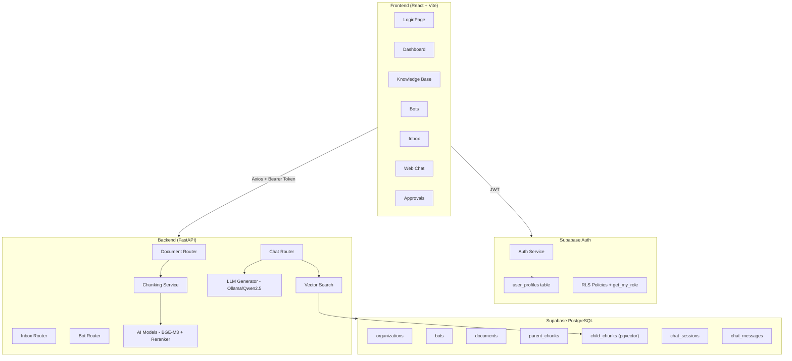
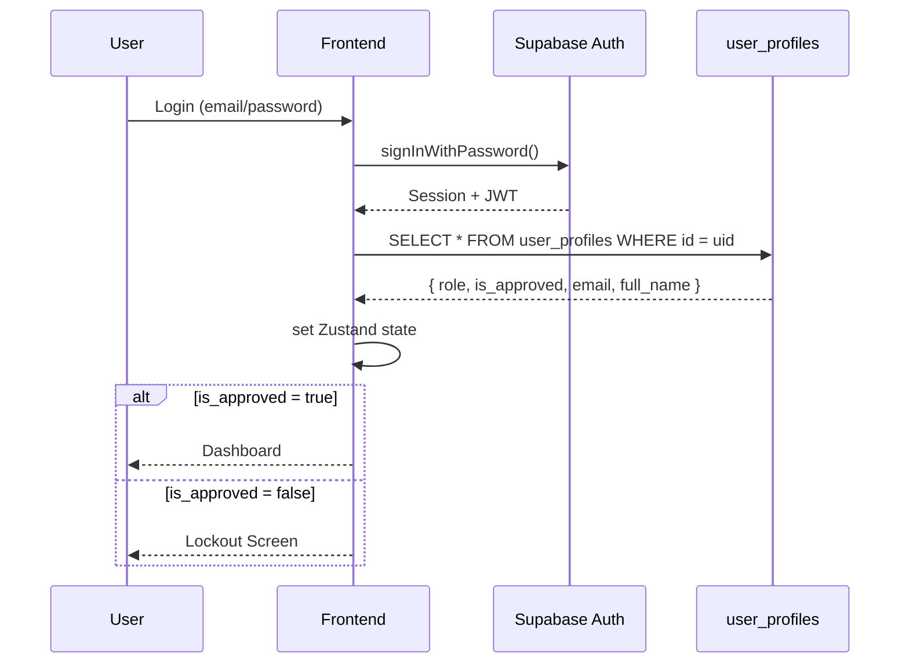
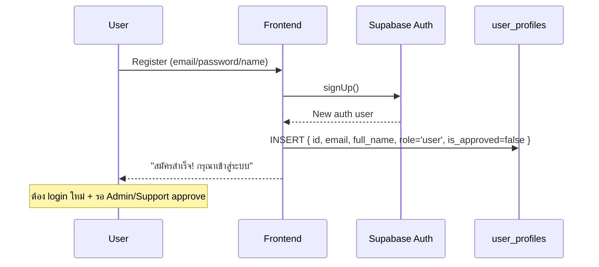

# SUNDAE — รายงานสรุปโปรเจกต์ฉบับเต็ม

> **วันที่รายงานครั้งแรก**: 25 กุมภาพันธ์ 2569
> **อัพเดทล่าสุด**: 11 มีนาคม 2569
> **Project**: SUNDAE — Enterprise AI Chatbot Platform
> **Stack**: FastAPI + React + Supabase + Ollama

---

## 1. ภาพรวมสถาปัตยกรรม (Architecture)



---

## 2. Backend (FastAPI + Python)

### 2.1 Project Structure ✅

```
backend/
├── app/
│   ├── main.py              # FastAPI app + CORS
│   ├── core/
│   │   ├── config.py         # Settings from .env
│   │   ├── auth.py           # JWT middleware (get_current_user, require_approved, require_role)
│   │   └── database.py       # Supabase async client (service role)
│   ├── routers/
│   │   ├── document.py       # Upload, list, delete
│   │   ├── chat.py           # Omnichannel (Web + LINE) + streaming SSE
│   │   ├── inbox.py          # Session management + human handoff
│   │   ├── bot.py            # Bot CRUD
│   │   └── health.py
│   ├── services/
│   │   ├── chunking.py       # Thai text splitter
│   │   ├── ai_models.py      # Embedding + Reranker
│   │   ├── vector_search.py  # Supabase RPC search
│   │   └── llm_generator.py  # Ollama/Qwen2.5
│   └── models/               # Pydantic schemas
├── sql/
│   ├── 001_schema.sql        # Full DB schema
│   ├── 002_add_missing_columns.sql
│   ├── 003_user_profiles_rls.sql
│   ├── 004_auth_trigger.sql
│   ├── 005_create_support_account.sql
│   ├── 006_match_chunks_bot_filter.sql
│   ├── 007_admin_role.sql
│   ├── 008_fix_organizations_rls.sql
│   └── 009_fix_user_profiles_rls_update.sql
└── requirements.txt
```

### 2.2 Database Schema ✅

| Table | Primary Key | สำคัญ |
|-------|------------|-------|
| `organizations` | UUID | Multi-tenant root |
| `user_profiles` | UUID (FK → auth.users) | role, is_approved, email, full_name |
| `bots` | UUID | prompt, line_access_token, is_web_enabled |
| `documents` | UUID | file_path, status, FK → bots |
| `document_parent_chunks` | UUID | content, metadata |
| `document_child_chunks` | UUID | **embedding vector(1024)**, FK → parent |
| `chat_sessions` | UUID | platform_source, status |
| `chat_messages` | UUID | role, content, FK → session |

RPC Function: `match_child_chunks` — cosine similarity search บน pgvector

### 2.3 AI Services ✅

| Service | Model | หน้าที่ |
|---------|-------|--------|
| Embedding | BAAI/bge-m3 (1024 dims) | แปลงข้อความเป็น vector |
| Reranker | BAAI/bge-reranker-v2-m3 | จัดลำดับผลลัพธ์ |
| LLM | Ollama/qwen2.5:3b ⚠️ | สร้างคำตอบจาก context (ดูหมายเหตุ) |
| Chunking | Custom Thai Splitter | ตัด text เป็น parent/child chunks |

### 2.4 Auth Middleware (core/auth.py)

```
get_current_user  → ตรวจ Bearer token → ดึง user_profiles จาก DB (service role)
require_approved  → เช็ค is_approved = true → 403 ถ้าไม่ผ่าน
require_role(...) → เช็ค role + is_approved → 403 ถ้าไม่ผ่าน
```

Backend ใช้ **Service Role Key** — bypass RLS ทั้งหมด ทำให้อ่านค่า `is_approved` จริงจาก DB เสมอ

---

## 3. Frontend (React + Vite + Tailwind v4)

### 3.1 Project Structure ✅

```
frontend/src/
├── api/
│   ├── supabaseClient.ts    # Singleton Supabase client (custom lock, periodic refresh)
│   ├── axios.ts             # JWT interceptor (3 layers)
│   └── endpoints.ts         # API calls (documents, chat, inbox, bots)
├── store/
│   ├── authStore.ts         # Zustand (signIn/signOut/fetchProfile)
│   └── toastStore.ts        # Toast notification state
├── types/
│   └── index.ts             # TypeScript interfaces (synced DB)
├── components/
│   ├── ProtectedRoute.tsx   # Role guard
│   └── ToastContainer.tsx   # Global toast UI
├── layouts/
│   ├── DashboardLayout.tsx  # Sidebar + approval lockout
│   └── AuthLayout.tsx       # Login background
├── pages/
│   ├── LoginPage.tsx        # Login + Registration tabs
│   ├── DashboardPage.tsx    # 3 role-based states
│   ├── WebChatPage.tsx      # Chat interface + streaming + cancel button
│   ├── ApprovalsPage.tsx    # Admin/Support approval list (real DB)
│   ├── KnowledgeBasePage.tsx
│   ├── BotsPage.tsx
│   ├── InboxPage.tsx        # Human handoff inbox (admin perspective)
│   └── IntegrationPage.tsx
├── App.tsx                  # AuthProvider + Routing
├── index.css                # NT CI Design System
└── main.tsx                 # Entry point
```

### 3.2 Token Protection Strategy (axios.ts) ✅

3 layers ป้องกัน token หมดอายุ:

```
Layer 1 (Request Interceptor) → getValidToken()
  → อ่าน session จาก cache
  → ถ้า expires_at - now < 300s (5 นาที) → refreshSession() ก่อน
  → ส่ง token ใหม่ทุก request

Layer 2 (Response Interceptor) → retry on 401
  → ถ้าได้ 401 → refreshTokenOnce() → retry request อีกครั้ง
  → ถ้า refresh fail → toast "เซสชันหมดอายุ" → redirect /login

Layer 3 (supabaseClient.ts)
  → Periodic refresh ทุก 4 นาที
  → Refresh เมื่อ tab กลับมา focus (หลังห่างไป 5 นาที)
```

**Mutex**: `refreshPromise` ป้องกัน concurrent refresh ที่จะ invalidate refresh token

### 3.3 บั๊ก JWT หมดอายุแล้วหน้าเว็บค้าง (401) — Patch Summary ✅

**อาการที่พบ**

- **[อาการ]** เปิดหน้าเว็บทิ้งไว้สักพัก → เริ่มกดใช้งานต่อไม่ได้/ส่งแชทไม่ได้ → Network ขึ้น `401 Unauthorized` หลาย endpoint พร้อมกัน
- **[อาการ]** ในหน้า Web Chat จะเห็น error เช่น `Not authenticated` และบางครั้งเหมือน UI “ค้าง” จนต้องกด Refresh เพื่อให้โหลด token ใหม่

**สาเหตุหลัก (Root Cause)**

- **[สาเหตุ]** เส้นทาง SSE streaming (`chatApi.askStream`) ใช้ `fetch` (ไม่ผ่าน axios interceptor)
- **[สาเหตุ]** การดึง session/token จาก Supabase (`getSession()`/`refreshSession()`) เคยมีโอกาส “ค้าง/ไม่ตอบกลับ” หรือคืน `session = null` หลัง idle/sleep/network ทำให้ไม่มี `Authorization` header แล้ว API 401 รัว ๆ
- **[ผล]** UI ฝั่งหน้าแชทตั้ง `isLoading=true` แล้วรอ callback (`onDone/onError`) หากโค้ดค้างก่อนเรียก callback จะดูเหมือนหน้าเว็บค้าง

**สิ่งที่แก้ไข (ไฟล์ + พฤติกรรม)**

- **[frontend/src/api/axios.ts]**
  - เพิ่ม timeout (`withTimeout` 10s) ครอบ `supabase.auth.getSession()` และ `supabase.auth.refreshSession()` เพื่อกัน await ค้าง
  - export `refreshTokenOnce()` เพื่อให้ flow ที่ไม่ได้ใช้ axios (SSE) reuse refresh mutex เดียวกัน

- **[frontend/src/api/endpoints.ts]** (เฉพาะ `chatApi.askStream`)
  - ถ้า `getValidToken()` ได้ `null` → toast “เซสชันหมดอายุ” → redirect `/login` (ไม่ต้องกด Refresh เอง)
  - ถ้า `fetch` ได้ `401` → `refreshTokenOnce()` → retry 1 ครั้ง
  - ถ้า refresh fail → toast + redirect `/login`

- **[frontend/src/api/supabaseClient.ts]** (Token keep-alive)
  - เพิ่ม timeout 10s ครอบ `getSession()`/`refreshSession()`
  - เพิ่ม mutex `refreshPromise` กัน refresh ซ้อน
  - เพิ่ม fail-safe: ถ้า `session` เป็น `null` หรือ refresh fail ต่อเนื่อง (>= 2 ครั้ง) → `signOut()` + ล้าง key `sb-*` + redirect `/login`

**ผลลัพธ์ที่คาดหวังหลังแก้**

- **[expected]** ถ้า access token หมดอายุแต่ refresh ยังใช้ได้ → ระบบ refresh แล้วใช้งานต่อเนื่องได้
- **[expected]** ถ้า refresh token ตาย/ได้ session = null → ระบบจะเด้งไป `/login` อัตโนมัติ (ไม่ค้าง และไม่ต้อง Refresh หน้าเอง)

**วิธีทดสอบ**

- **[ทดสอบ]** เปิด `/chat` ทิ้งไว้จน token ใกล้หมดอายุ แล้วลองส่งข้อความ
- **[ทดสอบ]** สลับเน็ต/ปล่อยเครื่อง sleep แล้วกลับมา ลองส่งข้อความ
- **[ทดสอบ]** ดูใน Network ว่าถ้ามี `401` จะ redirect ไป `/login` และไม่ค้างหน้าเดิม

---

### 3.4 Admin Inbox Realtime + สถานะช่วยเหลือเรียบร้อย (helped) — Patch Summary ✅

**เป้าหมาย**

- **[เป้าหมาย]** เมื่อผู้ใช้กดเรียก Admin → หน้า Inbox ของ Admin ต้องเห็น session ใหม่/ข้อความใหม่แบบอัตโนมัติ
- **[เป้าหมาย]** Admin กด “รับเรื่อง” แล้วคุยแทน bot ได้ทันที
- **[เป้าหมาย]** เปลี่ยนปุ่ม “ปิดเคส” เป็น “ช่วยเหลือเรียบร้อย” เพื่อไม่ล็อก user (ยังใช้งานแชทเดิม + เรียก admin ได้อีก)

**สิ่งที่แก้ไข (ไฟล์ + พฤติกรรม)**

- **[frontend/src/pages/InboxPage.tsx]**
  - เพิ่ม polling:
    - session list ทุก 3s (silent refresh ไม่กระพริบ loading)
    - new messages ทุก 2s ผ่าน `/api/inbox/sessions/{id}/messages/new`
  - เพิ่มสถานะ `helped` (label: “ช่วยเหลือเรียบร้อย”) และเปลี่ยนปุ่มจาก “ปิดเคส” → “ช่วยเหลือเรียบร้อย”

- **[frontend/src/pages/WebChatPage.tsx]**
  - `helped` ถือว่า “ยังใช้งานได้” เหมือน `active`:
    - input ไม่ถูกปิด
    - user ยังสามารถกด “ขอพูดคุยกับเจ้าหน้าที่” ได้
  - ถ้า backend เปลี่ยนสถานะเป็น `helped` จะขึ้น system message แจ้งว่า “ช่วยเหลือเรียบร้อยแล้ว…“

- **[frontend/src/types/index.ts]**
  - เพิ่ม `SessionStatus = "active" | "human_takeover" | "helped" | "resolved"`

- **[backend/app/routers/inbox.py]**
  - เพิ่ม `helped` ในสถานะที่อนุญาตสำหรับ update status
  - ปรับ behavior: ถ้า session เป็น `helped` แล้ว admin ส่งข้อความ → auto กลับไป `human_takeover`

**SQL ที่ต้องรันเพิ่ม (สำคัญ)**

- **[backend/sql/010_add_helped_status.sql]**
  - อัปเดต `CHECK constraint` ของ `chat_sessions.status` ให้รองรับค่า `helped`

---

### 3.5 สลับหน้า Bots → Inbox แล้วค้าง/เด้งกลับ Dashboard — Patch Summary ✅

**อาการที่พบ**

- **[อาการ]** สลับหน้าจาก `Bots` ไป `Inbox` → หน้า Inbox โหลดไม่ขึ้น/ใช้งานไม่ได้ จนต้องกด Refresh
- **[อาการ]** บางครั้งรอสักพักแล้วเหมือน “refresh เอง” และ/หรือถูกพากลับไปหน้า Dashboard

**สาเหตุหลัก (Root Cause)**

- **[สาเหตุ]** `/inbox` เป็น route ที่จำกัดสิทธิ์ (admin-only)
- **[สาเหตุ]** ตอน navigate ข้ามหน้า บางจังหวะ `isAuthenticated = true` แล้ว แต่ `user.role` ยังไม่ถูกโหลด (กำลัง `fetchProfile()`)
- **[ผล]** Route guard ประเมิน role เป็น `undefined` ชั่วคราว ทำให้เกิด routing ที่ไม่เสถียร/ค้าง/ต้อง refresh เพื่อให้ state กลับมาครบ

**วิธีแก้ (ไฟล์ + พฤติกรรม)**

- **[frontend/src/components/ProtectedRoute.tsx]**
  - ถ้า route มี `allowedRoles` แต่ `role` ยังไม่มา → แสดง loading state “กำลังโหลดสิทธิ์การใช้งาน...”
  - รอจน role โหลดเสร็จแล้วค่อยตัดสินใจอนุญาต/redirect

## 4. Supabase Auth Integration

### 4.1 Auth Flow



### 4.2 Registration Flow



---

## 5. RLS Security (Row Level Security)

### 5.1 Policies ปัจจุบัน (Final Version — migration 009)

```sql
-- Helper function (SECURITY DEFINER = bypass RLS ป้องกัน infinite recursion)
CREATE FUNCTION get_my_role() RETURNS TEXT
SECURITY DEFINER AS $$
    SELECT role FROM user_profiles WHERE id = auth.uid();
$$;

-- SELECT: ตัวเอง + Support/Admin ดูทุกคน
USING (id = auth.uid() OR get_my_role() IN ('support','admin'))

-- UPDATE: เฉพาะ Support/Admin (ป้องกัน privilege escalation)
-- มีทั้ง USING และ WITH CHECK (migration 009 เพิ่ม WITH CHECK)
USING (get_my_role() IN ('support','admin'))
WITH CHECK (get_my_role() IN ('support','admin'))

-- INSERT: สมัครสมาชิก (id ต้อง = auth.uid)
WITH CHECK (id = auth.uid())
```

### 5.2 Organizations RLS (migration 008)

```sql
-- แก้จาก org_isolation ที่ใช้ JWT claim ที่ไม่มีอยู่จริง
CREATE POLICY "org_read_own" ON organizations
    FOR SELECT USING (
        id IN (SELECT organization_id FROM user_profiles WHERE id = auth.uid())
    );
```

---

## 6. Bugs ที่พบ & แก้ไขแล้ว

| # | Bug | สาเหตุ | วิธีแก้ | ไฟล์ |
|---|-----|--------|---------|------|
| B1 | Loading screen ค้าง | ไม่มี `.catch()` + ไม่มี timeout | เพิ่ม `.catch()` + 5s timeout | `App.tsx` |
| B2 | user_profiles ไม่มี email/full_name | ขาด columns | เพิ่ม columns + sync types | `002_add_missing_columns.sql` |
| B3 | RLS blocks profile read | Policy ไม่มี SELECT สำหรับตัวเอง | เพิ่ม `id = auth.uid()` | `003_user_profiles_rls.sql` |
| B4 | RLS infinite recursion | Subquery ใน policy อ่าน user_profiles ซ้ำ | สร้าง `get_my_role()` SECURITY DEFINER | `003_user_profiles_rls.sql` |
| B5 | Stream ไม่ยิง request (Network ว่าง) | `import("./supabaseClient")` แบบ dynamic แฮงค์ใน Vite build | เปลี่ยนเป็น static import ที่ top | `endpoints.ts` |
| B6 | Organizations 406 Not Acceptable | RLS policy `org_isolation` ใช้ `auth.jwt() ->> 'organization_id'` ที่ไม่มีใน Supabase JWT | สร้าง policy ใหม่ใช้ subquery | `008_fix_organizations_rls.sql` |
| B7 | "Failed to fetch" บน Login | `signIn()` ไม่มี `catch` block | เพิ่ม `catch` + Thai error message | `authStore.ts` |
| B8 | User role 403 บน Inbox endpoints | `is_approved = false` ใน DB แม้ Admin กด approve แล้ว | RLS UPDATE policy ขาด `WITH CHECK` + approve ไม่ check rows affected | `009_fix_user_profiles_rls_update.sql`, `ApprovalsPage.tsx` |
| B9 | Stream หยุดทำงานหลังผ่านไปสักพัก | `askStream` ใช้ `getSession()` ดิบ ไม่เช็ค expiry ไม่ refresh token | เปลี่ยนเป็น `getValidToken()` ที่ export จาก axios.ts | `endpoints.ts`, `axios.ts` |
| B10 | Ollama unload model หลัง idle 30 นาที → stream ค้าง | `keep_alive: "30m"` → model ถูก unload → reload นาน → Network graph ว่าง | เพิ่มเป็น `keep_alive: "4h"` | `llm_generator.py` |
| B11 | Inbox Admin view: ข้อความ layout ผิด | ใช้ perspective ของ "user" — `user` messages ชิดขวา, `assistant` ชิดซ้าย | เปลี่ยนเป็น Admin perspective: user (ลูกค้า) ซ้าย, assistant+admin ขวา | `InboxPage.tsx` |

---

## 7. การแก้ไขสำคัญในรอบนี้ (มีนาคม 2569)

### 7.1 Stream Token Fix (B9)

**ปัญหา**: หลังใช้งานสักพัก JWT หมดอายุ แต่ `askStream` ใช้ `supabase.auth.getSession()` ดิบ → ได้ expired token → backend 401 → stream ล้มเหลว

**วิธีแก้**:
- Export `getValidToken()` จาก `axios.ts` (เดิมเป็น private function)
- `askStream` ใน `endpoints.ts` เปลี่ยนมาใช้ `getValidToken()` แทน
- ทำให้ stream ใช้ระบบ refresh เดียวกับ axios ทุก request (เช็ค expiry + refresh อัตโนมัติ)

```typescript
// ก่อน (ไม่เช็ค expiry)
const { data: { session } } = await supabase.auth.getSession();
token = session?.access_token;

// หลัง (auto-refresh ถ้าใกล้หมดอายุ)
const token = await getValidToken();
```

### 7.2 Ollama Keep-Alive Fix (B10)

**ปัญหา**: `keep_alive: "30m"` → Ollama unload model ออกจาก RAM หลัง idle 30 นาที → request ถัดไปต้อง reload model → ระหว่างนั้น Network graph ว่างเปล่า user คิดว่าระบบพัง

**วิธีแก้**: เปลี่ยน `keep_alive: "4h"` ใน `llm_generator.py` ทั้ง 2 ที่ (non-stream และ stream)

### 7.3 ApprovalsPage Silent Failure Fix (B8)

**ปัญหา**: Supabase UPDATE ที่ถูก RLS block จะ return `{ data: [], error: null }` — ไม่มี error แต่ไม่มี row ถูก update จริง Frontend ไม่รู้ว่าล้มเหลว

**วิธีแก้**: เพิ่ม `.select()` หลัง `.update()` → ถ้า `data.length === 0` → แสดง error toast "RLS policy blocked"

```typescript
// ก่อน (ไม่รู้ว่า update สำเร็จจริงไหม)
const { error } = await supabase.from("user_profiles").update({ is_approved: true }).eq("id", userId);

// หลัง (ตรวจสอบจริง)
const { data, error } = await supabase.from("user_profiles")
    .update({ is_approved: true }).eq("id", userId).select("id, is_approved");
if (!data || data.length === 0) { /* แจ้ง error */ }
```

### 7.4 RLS UPDATE WITH CHECK Fix (migration 009)

**ปัญหา**: UPDATE policy มีแค่ `USING` แต่ไม่มี `WITH CHECK` → พฤติกรรมอาจไม่ชัดเจนใน PostgreSQL

**วิธีแก้**: เพิ่ม `WITH CHECK (get_my_role() IN ('support', 'admin'))` และมี SQL สำหรับ approve user โดยตรงด้วย

### 7.5 Inbox Admin Perspective Fix (B11)

**ปัญหา**: `InboxPage.tsx` render messages ด้วย perspective ของ "user" — ข้อความ `role: "user"` (ลูกค้า) ชิดขวา แทนที่จะชิดซ้าย

**วิธีแก้**: เปลี่ยน layout logic เป็น Admin perspective:

| Role | ตำแหน่ง | สี | Avatar |
|---|---|---|---|
| `user` (ลูกค้า) | **ซ้าย** | ขาว + border | U (เทา) |
| `assistant` (AI SUNDAE) | **ขวา** | เหลืองอ่อน (brand) | S (เหลือง) |
| `admin` (เจ้าหน้าที่) | **ขวา** | น้ำเงิน | A (น้ำเงิน) |
| `system` | **กลาง** | แบนเนอร์เหลือง | — |

### 7.6 Cleanup ก่อน Push ไป GitHub

ลบไฟล์ test/dummy ออกทั้งหมด + เพิ่ม `.gitignore`:

**ลบ**:
- `docker_out.txt`, `dummy.docx`, `dummy.pdf`
- `test_results*.txt/json` ทั้งหมด (root + frontend)
- `test_backend_*.py` (root level)
- `frontend/e2e*.spec.ts`, `frontend/playwright.config.ts`
- `Manual Browser Test *.md`, `Test Object.md`, `UI Test Checklist.md`, `Next Step.md`

**เพิ่มใน .gitignore**:
```
.claude/          # Claude Code session files
test-results/     # Test output directories
frontend/test-results/
```

---

## 8. ไฟล์ที่แก้ไขในรอบนี้

| ไฟล์ | การเปลี่ยนแปลง |
|------|---------------|
| `frontend/src/api/axios.ts` | Export `getValidToken()` |
| `frontend/src/api/endpoints.ts` | ใช้ `getValidToken()` แทน raw `getSession()`, ลบ supabase import |
| `frontend/src/pages/ApprovalsPage.tsx` | เพิ่ม `.select()` หลัง update + ตรวจสอบ rows affected |
| `frontend/src/pages/InboxPage.tsx` | เปลี่ยนเป็น Admin perspective (user ซ้าย, AI+admin ขวา) |
| `backend/app/services/llm_generator.py` | `keep_alive: "30m"` → `"4h"` (ทั้ง stream และ non-stream) |
| `backend/sql/008_fix_organizations_rls.sql` | แก้ RLS policy organizations |
| `backend/sql/009_fix_user_profiles_rls_update.sql` | เพิ่ม WITH CHECK + SQL approve user |
| `.gitignore` | เพิ่ม `.claude/`, `test-results/` |

---

## 9. SQL Migrations (001 → 009) — ทำอะไรบ้าง

> **หมายเหตุ**: Migration 001-007 รันไปแล้วทั้งหมด ส่วน 008-009 รันล่าสุดในรอบนี้

---

### 001 — Schema หลัก ✅ รันแล้ว

**สร้าง tables ทั้งหมดของระบบ**:

| Table | หน้าที่ |
|-------|--------|
| `organizations` | Multi-tenant root — เก็บข้อมูลองค์กร |
| `bots` | Bot แต่ละตัวขององค์กร |
| `documents` | เอกสารที่อัพโหลด (PDF ฯลฯ) |
| `document_parent_chunks` | Chunk ขนาดใหญ่สำหรับส่งให้ LLM |
| `document_child_chunks` | Chunk เล็ก + **embedding vector(1024)** สำหรับ search |
| `chat_sessions` | Session การสนทนาแต่ละครั้ง |
| `chat_messages` | ข้อความทุกข้อในแต่ละ session |

สร้าง RPC function `match_child_chunks` สำหรับ cosine similarity search ด้วย pgvector

---

### 002 — เพิ่ม columns ที่ขาดหาย ✅ รันแล้ว

**ปัญหา**: หลัง schema 001 ถูก deploy แล้ว พบว่า frontend ต้องการ columns เพิ่มเติมที่ไม่มีใน schema แรก

**สิ่งที่เพิ่ม**:
```sql
-- bots table
ALTER TABLE bots ADD COLUMN line_access_token TEXT;         -- สำหรับ LINE integration
ALTER TABLE bots ADD COLUMN is_web_enabled BOOLEAN DEFAULT true;  -- เปิด/ปิด Web Chat

-- chat_sessions table
ALTER TABLE chat_sessions ADD COLUMN status TEXT            -- active | human_takeover | resolved
ALTER TABLE chat_sessions ADD COLUMN platform_source TEXT;  -- web | line | other
ALTER TABLE chat_sessions ADD COLUMN platform_user_id TEXT; -- User ID จาก platform
```

---

### 003 — user_profiles + RLS + get_my_role() ✅ รันแล้ว

**ปัญหา**: ระบบต้องการเก็บข้อมูล role และการ approve ของ user แต่ Supabase auth.users แก้ไขตรงๆ ไม่ได้

**สิ่งที่สร้าง**:

1. **Table `user_profiles`** — เชื่อมกับ `auth.users` เก็บ `role`, `is_approved`, `email`, `full_name`

2. **Function `get_my_role()`** — `SECURITY DEFINER` ป้องกัน infinite recursion ใน RLS policies:
```sql
-- ถ้าใช้ subquery ตรงๆ ใน policy จะเกิด recursion loop
-- แก้ด้วย function ที่ bypass RLS
CREATE FUNCTION get_my_role() RETURNS TEXT SECURITY DEFINER AS $$
    SELECT role FROM user_profiles WHERE id = auth.uid();
$$;
```

3. **RLS Policies**:
   - SELECT: user อ่านได้เฉพาะของตัวเอง, Support/Admin อ่านได้ทุกคน
   - UPDATE: เฉพาะ Support/Admin (ป้องกัน user เปลี่ยน role ตัวเอง)
   - INSERT: user สมัครได้เฉพาะ profile ของตัวเอง

4. **Seed admin account** (`admin@sundae.local`)

---

### 004 — Auth Trigger (Auto-create profile) ✅ รันแล้ว

**ปัญหา**: เมื่อ user สมัครสมาชิก (`signUp()`), Supabase สร้าง `auth.users` แต่ `user_profiles` ยังว่าง → RLS block ไม่ให้ user สร้าง profile ตัวเองได้เพราะ `auth.uid()` = null ระหว่างขั้นตอน email confirmation

**วิธีแก้**: สร้าง **database trigger** ที่ auto-สร้าง `user_profiles` ทันทีที่มี user ใหม่ใน `auth.users`:
```sql
CREATE TRIGGER on_auth_user_created
    AFTER INSERT ON auth.users
    FOR EACH ROW EXECUTE FUNCTION handle_new_auth_user();
-- → auto insert user_profiles (role=user, is_approved=false, organization=SUNDAE Demo Org)
```

---

### 005 — สร้าง Support Account ✅ รันแล้ว

**ปัญหา**: ต้องการ account สำหรับทีม Support ที่มี role = `support`

**วิธี**: ไม่สามารถ INSERT ตรงเข้า `auth.users` ได้ (จะทำให้ schema เสีย) ต้องใช้ Supabase Admin API สร้าง auth user ก่อน แล้วจึงรัน SQL อัพเดท role:
```sql
UPDATE user_profiles
SET role = 'support', is_approved = true, organization_id = '...'
WHERE email = 'support@sundae.local';
```

Login: `support@sundae.local` / `Sundae@2025`

---

### 006 — Bot Filter ใน Vector Search ✅ รันแล้ว

**ปัญหา**: `match_child_chunks` RPC เดิมค้นหา documents **ทั้งหมดในองค์กร** โดยไม่กรองว่า document ผูกกับ bot ไหน → Bot A อาจได้ข้อมูลจาก document ของ Bot B

**วิธีแก้**: เพิ่ม parameter `target_bot_id` ใน RPC function:
```sql
CREATE FUNCTION match_child_chunks(
    query_embedding VECTOR(1024),
    target_org_id   UUID,
    match_count     INTEGER DEFAULT 20,
    target_bot_id   UUID DEFAULT NULL  -- ← เพิ่มใหม่
)
-- ถ้าส่ง bot_id มา → กรองเฉพาะ documents ที่ผูกกับ bot นั้น
AND (target_bot_id IS NULL OR dcc.document_id IN (
    SELECT id FROM documents WHERE bot_id = target_bot_id
))
```

---

### 007 — เพิ่ม role 'admin' ใน chat_messages ✅ รันแล้ว

**ปัญหา**: เมื่อ Admin/Support ต้องการตอบกลับลูกค้าใน Inbox (Human Handoff) ระบบ error เพราะ constraint ของ `role` column ใน `chat_messages` ยอมรับแค่ `user`, `assistant`, `system`

**วิธีแก้**:
```sql
ALTER TABLE chat_messages DROP CONSTRAINT chat_messages_role_check;
ALTER TABLE chat_messages ADD CONSTRAINT chat_messages_role_check
    CHECK (role IN ('user', 'assistant', 'system', 'admin'));  -- ← เพิ่ม 'admin'
```

---

### 008 — แก้ Organizations RLS ✅ รันแล้ว (รอบนี้)

**ปัญหา**: Frontend ได้รับ HTTP 406 เมื่อ query `organizations` table เพราะ RLS policy เดิมใช้ `auth.jwt() ->> 'organization_id'` แต่ Supabase **ไม่ใส่ custom claim นี้ใน JWT** โดยอัตโนมัติ

**วิธีแก้**: เปลี่ยน policy ให้ query จาก `user_profiles` แทน:
```sql
DROP POLICY "org_isolation" ON organizations;

CREATE POLICY "org_read_own" ON organizations FOR SELECT USING (
    id IN (SELECT organization_id FROM user_profiles WHERE id = auth.uid())
);
CREATE POLICY "org_service_role" ON organizations FOR ALL USING (
    auth.role() = 'service_role'
);
```

---

### 009 — แก้ RLS UPDATE + Approve User ✅ รันแล้ว (รอบนี้)

**ปัญหา**: Admin กด "อนุมัติ" ใน ApprovalsPage แต่ `is_approved` ไม่เปลี่ยนเป็น `true` ใน DB เพราะ:
1. RLS UPDATE policy มีแค่ `USING` ไม่มี `WITH CHECK` → Supabase อาจ block แบบเงียบ
2. Frontend ไม่ตรวจสอบว่า update สำเร็จจริงหรือเปล่า

**วิธีแก้**:
```sql
-- ลบ policy เก่า แล้วสร้างใหม่พร้อม WITH CHECK
DROP POLICY "Only support/admin can update profiles" ON user_profiles;
CREATE POLICY "Only support/admin can update profiles"
ON user_profiles FOR UPDATE
USING    (get_my_role() IN ('support', 'admin'))
WITH CHECK (get_my_role() IN ('support', 'admin'));  -- ← เพิ่มใหม่

-- Approve user โดยตรง (สำรองถ้า UI ยังไม่ทำงาน)
UPDATE user_profiles SET is_approved = true
WHERE email = 'sawasdichai.amor@bumail.net' AND is_approved = false;
```

---

### สรุป Migration ทั้งหมด

| # | Migration | สถานะ | ปัญหาที่แก้ |
|---|-----------|-------|------------|
| 001 | Schema หลัก | ✅ รันแล้ว | สร้าง DB ทั้งหมด |
| 002 | เพิ่ม columns | ✅ รันแล้ว | LINE integration + session status |
| 003 | user_profiles + RLS | ✅ รันแล้ว | ระบบ role + is_approved + get_my_role() |
| 004 | Auth trigger | ✅ รันแล้ว | Auto-create profile ตอนสมัครสมาชิก |
| 005 | Support account | ✅ รันแล้ว | สร้าง Support user |
| 006 | Bot filter vector search | ✅ รันแล้ว | Bot ค้นหาเฉพาะ doc ของตัวเอง |
| 007 | Admin role in messages | ✅ รันแล้ว | Human handoff ตอบกลับได้ |
| 008 | Fix organizations RLS | ✅ รันแล้ว | แก้ 406 error บน organizations |
| 009 | Fix UPDATE RLS + approve | ✅ รันแล้ว | แก้ approve ไม่ทำงาน |
| 010 | Add helped status | 🟡 ต้องรัน | เพิ่มสถานะ `helped` (ช่วยเหลือเรียบร้อย) ให้ chat_sessions.status |

---

## 10. ⚠️ LLM Model — qwen2.5:3b (ปัจจุบัน) แทน qwen3:14b

### สาเหตุที่เปลี่ยน

| Model | RAM ที่ต้องการ | สถานะ |
|-------|--------------|-------|
| `qwen3:14b` | ~16 GB | ❌ RAM ไม่พอบนเครื่อง dev |
| `qwen2.5:7b` | ~8 GB | ⚠️ ได้ถ้า RAM พอ |
| **`qwen2.5:3b`** | **~4 GB** | ✅ **ใช้อยู่ปัจจุบัน** |

Model ถูก set ผ่าน `LLM_MODEL=qwen2.5:3b` ใน `backend/.env`

### ผลกระทบต่อคุณภาพ

| ด้าน | qwen3:14b | qwen2.5:3b |
|------|-----------|------------|
| ภาษาไทย | ดีมาก | ดี (อาจสั้นกว่า) |
| ความแม่นยำ | สูง | ปานกลาง-สูง |
| ความเร็ว | ช้ากว่า | เร็วกว่า |
| RAM | 16 GB | 4 GB |

### ไฟล์ที่เกี่ยวข้อง (ไม่ต้องแก้ — อ่านจาก .env อัตโนมัติ)

| ไฟล์ | สิ่งที่ทำ | แก้แล้ว? |
|------|---------|---------|
| `backend/.env` | `LLM_MODEL=qwen2.5:3b` | ✅ ถูกต้องแล้ว |
| `backend/.env.example` | อัพเดท default + comment เลือก model | ✅ แก้แล้ว |
| `backend/app/core/config.py` | default `qwen2.5:3b` | ✅ แก้แล้ว |
| `backend/app/services/llm_generator.py` | docstring comment | ✅ แก้แล้ว |
| `backend/tests/test_llm_generator.py` | hardcode `qwen3:14b` ใน test params | ⚠️ **ยังไม่แก้** (ดูด้านล่าง) |

### ⚠️ สิ่งที่ต้องแก้เพิ่มในโปรเจกต์

**1. Unit tests (`backend/tests/test_llm_generator.py`)**

Tests hardcode `llm_model="qwen3:14b"` ไว้ 7 ที่ — ควรเปลี่ยนเป็น `qwen2.5:3b` หรือ mock model name แทน:

```python
# ก่อน (7 ที่ใน test file)
llm_model="qwen3:14b"

# หลัง
llm_model="qwen2.5:3b"
```

**2. `backend/scripts/evaluate_accuracy.py`**

มี comment: `"Ollama running with qwen3:14b loaded"` — ควรอัพเดทเป็น `qwen2.5:3b`

**3. ถ้า upgrade RAM ในอนาคต**

เปลี่ยนแค่บรรทัดเดียวใน `backend/.env`:
```
LLM_MODEL=qwen2.5:7b   # ถ้ามี RAM 8 GB
LLM_MODEL=qwen3:14b    # ถ้ามี RAM 16 GB
```
ไม่ต้องแก้ code ที่ไหนเลย เพราะ `llm_generator.py` อ่านค่าจาก `settings.llm_model` เสมอ

---

## 10. Admin Account (สำหรับทดสอบ)

| Field | Value |
|-------|-------|
| 📧 Email | `admin@sundae.local` |
| 🔑 Password | `Sundae@2025` |
| 👑 Role | `admin` |
| ✅ Approved | `true` |

---

## 11. สิ่งที่ต้องทำก่อน Push ไป GitHub

### SQL ที่ต้องรันใน Supabase SQL Editor (ถ้ายังไม่ได้รัน)

```sql
-- Migration 009: แก้ RLS UPDATE + approve user
-- ไฟล์: backend/sql/009_fix_user_profiles_rls_update.sql

-- Migration 010: เพิ่มสถานะ helped (ช่วยเหลือเรียบร้อย)
-- ไฟล์: backend/sql/010_add_helped_status.sql
```

### คำสั่ง Run Development

```bash
# Backend
cd backend
uvicorn app.main:app --host 0.0.0.0 --port 8001 --reload

# Frontend
cd frontend
npm run dev
```

---

## 12. Next Steps

### 🟡 งานที่เหลือ

| # | งาน | รายละเอียด |
|---|------|-----------|
| 1 | **ทดสอบ keep_alive 4h** | ใช้งานต่อเนื่อง > 30 นาที แล้วดูว่า stream ยังทำงานได้ไหม |
| 2 | **LINE Webhook** | ดูรายละเอียดด้านล่าง (Section 13) |
| 3 | **Docker deployment** | ทดสอบ build + run บน Docker สำหรับ production |
| 4 | **User profile edit** | ให้ user แก้ full_name ของตัวเอง |
| 5 | **Dark mode** | เพิ่ม theme switcher |

---

## 13. LINE Webhook — งานที่เหลือ

### สถานะปัจจุบัน

| ส่วน | สถานะ | รายละเอียด |
|------|--------|-----------|
| `chat.py` — `platform_source: "line"` | ✅ มีแล้ว | RAG pipeline รองรับ LINE platform แล้ว |
| `bot.py` — field `line_access_token` | ✅ มีแล้ว | CRUD เก็บ token ต่อ bot ได้ |
| DB — `bots.line_access_token` | ✅ มีแล้ว | Column เพิ่มผ่าน SQL migration 002 |
| DB — `chat_sessions.platform_source` | ✅ มีแล้ว | รองรับ `web \| line \| other` |
| Frontend — `IntegrationPage.tsx` | ⚠️ Mock | Toggle LINE เป็น useState เฉยๆ ยังไม่เชื่อม API |
| Backend — LINE Webhook endpoint | ❌ ยังไม่มี | ต้องสร้างใหม่ |
| Backend — LINE reply | ❌ ยังไม่มี | ต้องเรียก LINE Messaging API |

### งานที่ต้องทำ

| # | งาน | ไฟล์ | รายละเอียด |
|---|------|------|-----------|
| 1 | **สร้าง LINE Webhook endpoint** | `backend/app/routers/line_webhook.py` (ใหม่) | สร้าง route `POST /webhook/line` รับ events จาก LINE Platform, verify signature ด้วย `X-Line-Signature` + `HMAC-SHA256` |
| 2 | **LINE reply function** | `backend/app/services/line_service.py` (ใหม่) | ใช้ `httpx` เรียก `https://api.line.me/v2/bot/message/reply` ส่งคำตอบกลับ user ผ่าน LINE |
| 3 | **เพิ่ม config** | `backend/.env` + `config.py` | เพิ่ม `LINE_CHANNEL_SECRET` สำหรับ verify webhook signature |
| 4 | **ติดตั้ง dependency** | `requirements.txt` | เพิ่ม `line-bot-sdk` หรือใช้ `httpx` เรียก LINE API ตรงๆ (ไม่ต้องเพิ่ม dependency) |
| 5 | **Integration Page เชื่อม API** | `frontend/src/pages/IntegrationPage.tsx` | ให้ toggle LINE บันทึก `line_access_token` + `LINE_CHANNEL_SECRET` ลง bot จริง แทน useState mock |
| 6 | **ทดสอบ end-to-end** | — | LINE ส่งข้อความ → webhook → RAG pipeline → reply กลับ LINE |

### Flow ที่ต้อง implement

```
LINE User ส่งข้อความ
    │
    ▼
LINE Platform POST /webhook/line
    │
    ├─ 1. Verify signature (HMAC-SHA256 + LINE_CHANNEL_SECRET)
    ├─ 2. Parse event → ดึง user_id, message text, reply_token
    ├─ 3. หา bot ที่ match (จาก line_access_token ใน DB)
    ├─ 4. เรียก RAG pipeline (chat.py logic เดิม)
    ├─ 5. Reply กลับ LINE ผ่าน Messaging API + reply_token
    │
    ▼
LINE User ได้รับคำตอบ
```

### Environment Variables ที่ต้องเพิ่ม

```env
# LINE Messaging API
LINE_CHANNEL_SECRET=your_channel_secret_here
# line_access_token เก็บใน DB ต่อ bot (มีแล้ว)
```
