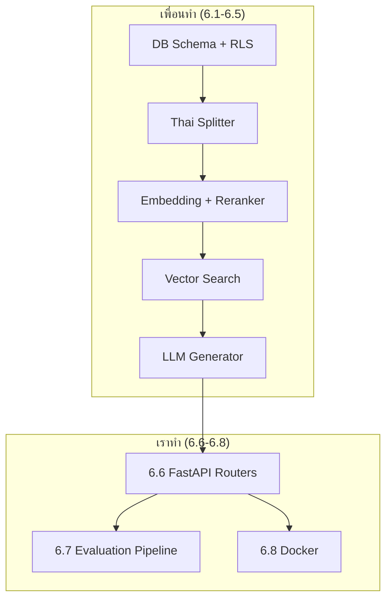
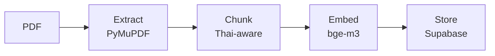
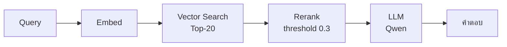
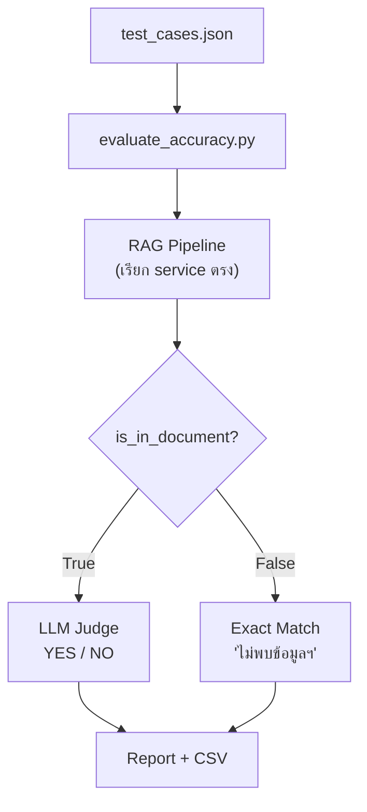
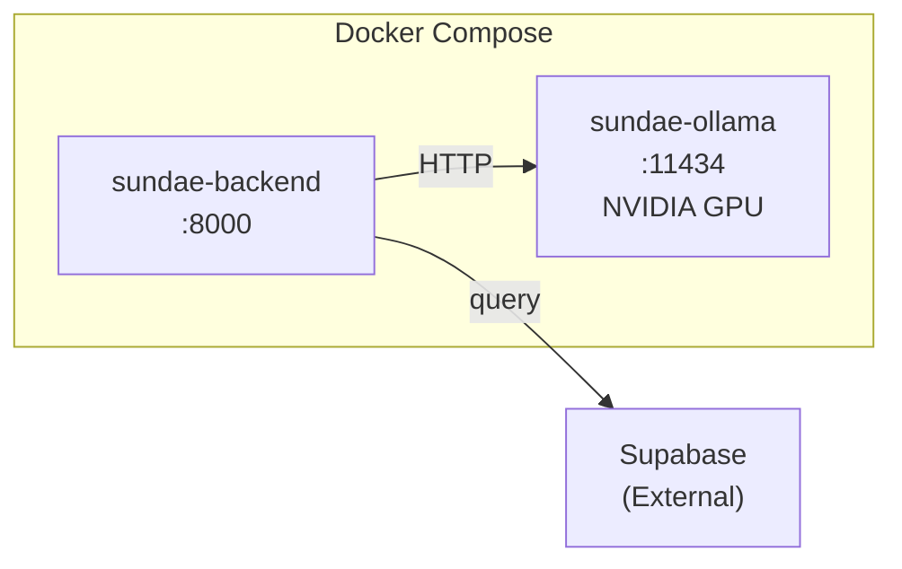

# 📋 SUNDAE Backend — Walkthrough สรุปงานที่เราทำต่อจากเพื่อน

## ภาพรวม

เพื่อนสร้าง **Backend Foundation** (Task 6.1–6.5) ไว้ครบ: DB schema, Thai splitter, Embedding, Reranker, Vector search, LLM generator + 60 unit tests  
เราทำต่อ **3 Tasks (6.6–6.8):** เชื่อมทุก service เข้าด้วยกัน + ระบบทดสอบ + Docker



---

## Task 6.6 — FastAPI Routers

เชื่อม service ทั้งหมดเข้าเป็น API endpoints

### ไฟล์ใหม่

#### `backend/app/routers/document.py` — `POST /api/documents/upload`



- รับ PDF → extract text → chunk → embed → store ใน Supabase
- Track สถานะ: `pending → processing → ready / error`
- **ทุก insert มี `organization_id`** ป้องกัน cross-tenant

#### `backend/app/routers/chat.py` — `POST /api/chat/ask`



- Full RAG pipeline ใน endpoint เดียว
- Response มี `sources[]` สำหรับ traceability
- รองรับ `session_id` สำหรับ log ประวัติแชท

#### Test Files
- `backend/tests/test_router_document.py` — 5 tests
- `backend/tests/test_router_chat.py` — 6 tests

### ไฟล์ที่แก้

| ไฟล์ | การแก้ไข |
|------|---------|
| `backend/requirements.txt` | +`PyMuPDF` +`python-multipart` |
| `backend/app/main.py` | Register `document.router` + `chat.router` |

---

## Task 6.7 — Evaluation Pipeline

วัด accuracy ของ RAG แบบอัตโนมัติ ด้วย LLM-as-a-Judge



### ไฟล์ใหม่

| ไฟล์ | หน้าที่ |
|------|--------|
| `backend/scripts/test_cases.json` | 5 test cases (3 ปกติ + 2 adversarial) |
| `backend/scripts/evaluate_accuracy.py` | ทั้ง pipeline + console report + CSV |

**วิธีรัน:**
```bash
cd backend
python -m scripts.evaluate_accuracy --org-id "your-org-uuid"
```

**Output:** Console report พร้อม accuracy bar + `evaluation_results.csv`

---

## Task 6.8 — Docker

Containerize ทั้งระบบ พร้อม GPU pass-through



### ไฟล์

| ไฟล์ | สถานะ | คำอธิบาย |
|------|-------|---------|
| `backend/Dockerfile` | แก้ไข | Multi-stage + system deps + healthcheck |
| `docker-compose.yml` | สร้างใหม่ | Backend + Ollama (GPU + persistent volume) |
| `backend/.env.example` | แก้ไข | Docker-aware comments |
| `.gitignore` | แก้ไข | +`ollama_data/` |

**Deploy:**
```bash
cp backend/.env.example backend/.env  # แก้ค่า Supabase
docker compose up -d
docker compose exec ollama ollama pull qwen3:14b
```

---

## Security Checklist

- [x] ทุก DB insert มี `organization_id` — ป้องกัน cross-tenant leak
- [x] Vector search ส่ง `target_org_id` เสมอ
- [x] Parent fetch filter ด้วย `organization_id` ซ้ำ
- [x] Chat log insert มี `organization_id` ทุก record
- [x] Error handling ครอบคลุม — ไม่มี unhandled exception ที่ crash API

---

## สรุปไฟล์ทั้งหมดที่เราสร้าง/แก้

| # | ไฟล์ | ประเภท |
|---|------|--------|
| 1 | `app/routers/document.py` | สร้างใหม่ |
| 2 | `app/routers/chat.py` | สร้างใหม่ |
| 3 | `tests/test_router_document.py` | สร้างใหม่ |
| 4 | `tests/test_router_chat.py` | สร้างใหม่ |
| 5 | `scripts/evaluate_accuracy.py` | สร้างใหม่ |
| 6 | `scripts/test_cases.json` | สร้างใหม่ |
| 7 | `scripts/__init__.py` | สร้างใหม่ |
| 8 | `docker-compose.yml` | สร้างใหม่ |
| 9 | `requirements.txt` | แก้ไข |
| 10 | `app/main.py` | แก้ไข |
| 11 | `Dockerfile` | แก้ไข |
| 12 | `.env.example` | แก้ไข |
| 13 | `.gitignore` | แก้ไข |

> **รวม: 8 ไฟล์ใหม่ + 5 ไฟล์แก้ไข = 13 ไฟล์**
